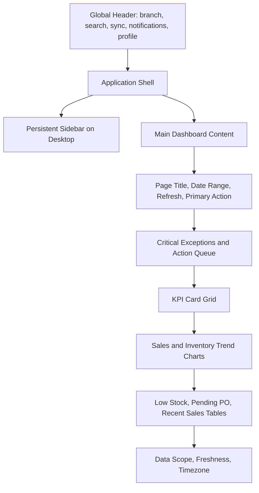
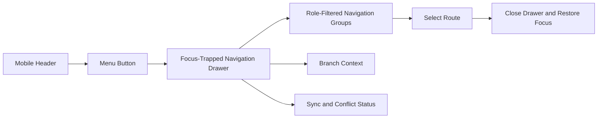

# Enterprise Dashboard UI Design

## 1. Design Intent

The Predictive Inventory System dashboard is an operational command center for Steven Hydrotech Exponent Water Treatment and Supply Services. It prioritizes decisions over decoration: stockout risk, pending procurement work, sales movement, planning recommendations, and synchronization health must be understandable within seconds.

The visual system follows modern enterprise SaaS principles: restrained surfaces, strong information hierarchy, consistent interaction patterns, accessible contrast, concise labels, and responsive density. The design supports Owners, Managers, and Staff without exposing unavailable controls or sensitive metrics.

## 2. Experience Principles

- Put urgent exceptions before historical context: stockout risk, overdue receipts, failed sync, and required approvals are always visible above trend analysis.
- Make data scope explicit. Every KPI, chart, and table displays branch, date range, currency, timezone, and freshness where relevant.
- Use color as a supporting signal, never the only indicator of status or urgency.
- Preserve a stable shell and predictable control placement across all operational modules.
- Favor compact, readable data density on desktop and clear action prioritization on mobile.
- Use motion only to clarify a successful state change, panel transition, or progressive disclosure; respect reduced-motion preferences.

## 3. Visual Foundation

### 3.1 Color palette

The palette uses a neutral blue-slate foundation with a water-treatment-inspired indigo accent. Color values are design tokens, not ad hoc component choices.

| Token | Value | Use |
| --- | --- | --- |
| `surface-canvas` | `#F7F9FC` | Application background. |
| `surface-default` | `#FFFFFF` | Cards, panels, dialogs, tables. |
| `surface-subtle` | `#F1F5F9` | Secondary panels, table headers, skeleton base. |
| `surface-selected` | `#EAF2FF` | Active navigation, selected table row, focused non-input region. |
| `border-default` | `#D8E0EA` | Standard borders and dividers. |
| `border-strong` | `#AAB7C7` | Focus-adjacent and emphasized structure. |
| `text-primary` | `#172033` | Headings and primary data. |
| `text-secondary` | `#526176` | Labels, supporting content, metadata. |
| `text-muted` | `#748297` | Placeholder and lower-priority metadata. |
| `brand-50` | `#EFF6FF` | Tinted selected or informational background. |
| `brand-600` | `#2563EB` | Primary buttons, active focus ring, primary links. |
| `brand-700` | `#1D4ED8` | Primary hover and active navigation text. |
| `success-50` | `#ECFDF3` | Success background. |
| `success-700` | `#15803D` | Success text, icon, and badge border. |
| `warning-50` | `#FFFBEB` | Warning background. |
| `warning-700` | `#B45309` | Warning text, icon, and badge border. |
| `danger-50` | `#FEF2F2` | Danger background. |
| `danger-700` | `#B91C1C` | Danger text, icon, and badge border. |
| `info-50` | `#EFF6FF` | Informational background. |
| `info-700` | `#1D4ED8` | Informational text and icon. |

### 3.2 Semantic status mapping

| Semantic state | Label pattern | Color treatment | Typical use |
| --- | --- | --- | --- |
| Healthy | “In stock”, “Synchronized”, “Approved” | Success badge with icon or text | Verified positive status. |
| Attention | “Low stock”, “Pending”, “Due soon” | Warning badge with icon or text | Action soon, not yet critical. |
| Critical | “Stockout risk”, “Failed”, “Overdue” | Danger badge with icon or text | Immediate operational intervention. |
| Informational | “Draft”, “Forecast”, “Queued” | Info or neutral badge | Non-final workflow context. |
| Inactive | “Archived”, “Disabled”, “No data” | Neutral badge | Non-actionable state. |

All semantic colors meet WCAG 2.2 AA contrast requirements in their intended text and icon combinations. Badges always include text; charts include labels, legends, and data alternatives.

## 4. Typography

Use a single modern sans-serif family optimized for UI readability, such as Inter or a similarly licensed system fallback stack. Do not mix display faces into operational views.

| Token | Size / line height | Weight | Use |
| --- | --- | --- | --- |
| `display-sm` | 30 / 38 px | 700 | Dashboard title only. |
| `heading-lg` | 24 / 32 px | 700 | Primary page heading. |
| `heading-md` | 20 / 28 px | 650–700 | Major panel heading. |
| `heading-sm` | 16 / 24 px | 600 | Card, table, modal heading. |
| `body-md` | 14 / 22 px | 400 | Standard body and input text. |
| `body-sm` | 13 / 20 px | 400 | Metadata and dense table content. |
| `label-sm` | 12 / 18 px | 600 | Field labels, uppercase only for small categorical metadata. |
| `metric-lg` | 28 / 34 px | 700 | KPI values. |
| `metric-sm` | 18 / 24 px | 650 | Secondary metric values. |

Use tabular numerals for currency, quantities, percentages, dates, and KPI values. Numeric columns are right-aligned. Avoid all-caps for full labels; when used for compact metadata, include adequate letter spacing and preserve readable casing for screen readers.

## 5. Spacing, Radius, and Elevation

### 5.1 Spacing scale

Use a 4 px base unit. Components use the following approved scale:

| Token | Size | Use |
| --- | --- | --- |
| `space-1` | 4 px | Icon-to-label gap, tight inline grouping. |
| `space-2` | 8 px | Form field internal gaps, compact controls. |
| `space-3` | 12 px | Standard component padding and list spacing. |
| `space-4` | 16 px | Card padding on compact screens, control groups. |
| `space-5` | 20 px | Card padding on desktop, section internals. |
| `space-6` | 24 px | Grid gaps, page section spacing. |
| `space-8` | 32 px | Major page-section separation. |
| `space-10` | 40 px | Large dashboard separation. |
| `space-12` | 48 px | Reserved for sparse empty or error states. |

### 5.2 Surface language

- Standard card radius: 12 px. Compact input, button, and badge radius: 8 px or 999 px only for pills.
- Default cards use a 1 px `border-default`; avoid heavy shadows as structural separators.
- Raised menus, popovers, and dialogs use a soft elevation with shadow and an outline, preserving visible separation on bright displays.
- Page background remains `surface-canvas`; nested cards stay `surface-default`; do not stack multiple tinted backgrounds without a hierarchy reason.

## 6. Grid and Layout

### 6.1 Desktop grid

| Viewport | Content layout | Margin | Column behavior |
| --- | --- | --- | --- |
| 1440 px and above | 12-column fluid grid | 32 px | Main content uses 12 columns; KPI cards span 3 columns. |
| 1024–1439 px | 12-column fluid grid | 24 px | KPI cards span 3 or 4 columns based on priority. |
| 768–1023 px | 8-column grid | 20 px | Sidebar collapses; KPI cards span 4 columns. |
| 480–767 px | 4-column grid | 16 px | Cards are single-column unless compact comparison is essential. |
| Below 480 px | 4-column fluid grid | 12 px | Single primary action and stacked controls. |

### 6.2 Dashboard composition

### 6.3 Primary dashboard layout

| Region | Desktop placement | Content |
| --- | --- | --- |
| Global header | Fixed top, full width | Branch selector, global search, sync state, notifications, profile menu. |
| Sidebar | Fixed left below header | Role-filtered primary navigation and compact system status. |
| Page header | Main content top | Title, description, date range, refresh timestamp, export or contextual action. |
| Exception strip | Immediately below page header | Critical low stock, failed sync, overdue receipt, and approval count. |
| KPI grid | Top analytics row | Available stock value, low-stock products, pending PO value, today’s sales. |
| Trend row | Middle analytics row | Sales trend, stock-risk trend, forecast versus demand. |
| Operations row | Lower action row | Low-stock queue, pending procurement, recent sales or movement activity. |
| Scope footer | Bottom of content | Branch, filters, timezone, currency, and source freshness. |

## 7. Sidebar Design

The sidebar is the stable orientation system for the application. It is 264 px wide on desktop, collapsible to 72 px when the user explicitly chooses compact navigation, and is never the only place an urgent action can be found.

### 7.1 Sidebar groups

| Group | Navigation items |
| --- | --- |
| Overview | Dashboard |
| Operations | POS, Sales, Inventory, Adjustments, Movement History, Goods Receiving |
| Procurement | Purchase Orders, Suppliers |
| Catalog | Products, Categories, Units of Measure |
| Planning | Forecasting, Replenishment Alerts, Reorder Policies |
| Intelligence | Reports, Audit Trail |
| Administration | Users, Branches, System Settings |

### 7.2 Sidebar behavior

- Each item has an icon, visible label, active state, and accessible current-page indication.
- Inactive or unauthorized items are omitted rather than shown as broken navigation. Permission-denied deep links still render an access-denied page.
- The active item uses `surface-selected`, `brand-700` text, and a visible left or inset indicator; color alone is not the active signal.
- Group labels use `label-sm`; groups collapse only when this does not hide the active location.
- The footer shows a compact sync state and application version only when operationally useful.
- Sidebar scroll is independent from main content on desktop so navigation remains reachable on long pages.

## 8. Header Design

The header is 64 px tall on desktop and 56 px on mobile. It remains visible during standard application navigation and has a solid `surface-default` background with a bottom border.

| Header element | Behavior |
| --- | --- |
| Branch selector | Required before branch-scoped data loads; shows selected branch, authorization state, and change affordance. |
| Global search | Opens a command-style search for products, PO numbers, receipt numbers, sale numbers, and permitted records; does not search unauthorized data. |
| Sync indicator | Shows online/offline state, pending count, last successful sync, and critical conflict badge. |
| Notifications | Displays actionable, deduplicated notifications; never replaces in-page error states. |
| Profile menu | Shows name, role summary, account controls, and sign-out. |
| Mobile menu control | Opens accessible navigation drawer only below desktop breakpoint. |

The header never uses a global spinner to block all navigation. It preserves current branch and sync context while background refresh occurs.

## 9. Mobile Navigation

On screens below 1024 px, the desktop sidebar becomes a modal navigation drawer. The drawer is initiated by a labeled menu button in the header.

- The drawer supports Escape, visible close control, focus trap, focus restoration, and scroll lock.
- Route selection closes the drawer before navigation completes.
- The most important page-level action stays in the page header or a mobile action bar; users do not reopen navigation to complete work.
- Tables move to responsive detail rows or controlled horizontal scroll with pinned identifier column; they never compress key values into unreadable cells.
- Touch targets are at least 44 × 44 px, and compact icon controls always have text alternatives.

## 10. Components

### 10.1 Buttons

| Variant | Appearance | Use |
| --- | --- | --- |
| Primary | `brand-600` fill, white text | One main action per region: Create PO, Receive Goods, Finalize Sale. |
| Secondary | White surface, strong border, primary text | Supporting actions: Save Draft, Refresh, View Details. |
| Tertiary | Text or subtle background | Low-emphasis local actions: Clear Filters, Cancel. |
| Danger | Danger fill or outlined danger style | Irreversible or compensating actions: Void, Reverse, Delete Draft. |
| Icon | Compact button with tooltip and accessible label | Row actions, navigation controls, only where meaning is familiar. |

Buttons begin with a verb, show pending state without changing layout, and prevent duplicate submission. Disabled buttons explain non-obvious reasons in nearby text or tooltip. Destructive buttons require confirmation and server authorization.

### 10.2 Inputs and filters

| Component | Design rule |
| --- | --- |
| Text input | Visible label, optional supporting description, clear error text, 40–44 px height. |
| Search input | Leading search icon, clear action, debounced query behavior, result count or empty state. |
| Select / combobox | Searchable for long datasets, keyboard navigable, displays selected value clearly. |
| Date range | Shows timezone and inclusive range semantics; validates complete and logical ranges. |
| Quantity / money input | Right-aligns numeric values, shows unit or currency prefix/suffix, avoids floating-point display ambiguity. |
| Toggle | Used only for immediate binary settings; not for destructive state or approval actions. |

Input labels are never placeholders. Required status is communicated in text and semantics, not an asterisk alone. Server errors display next to the responsible field; conflicts and workflow errors display at form level.

### 10.3 Cards

| Card type | Structure | Use |
| --- | --- | --- |
| KPI card | Label, metric, trend or comparison, status note, optional drill-down link | High-level operational metric. |
| Action card | Title, short description, count or severity, clear action | Low-stock risk, approval queue, sync conflict. |
| Chart card | Title, scope metadata, chart, accessible summary, legend, footer insight | Trend and comparison analysis. |
| Detail card | Heading, structured values, local actions | Product, PO, receipt, adjustment summary. |
| Empty-state card | Illustration or restrained icon, title, explanation, permitted next action | No data or filtered result. |

KPI cards do not use decorative gradients. Each KPI contains a descriptive label and comparison context such as “vs previous 7 days” only when the comparison is valid and clearly scoped.

### 10.4 Badges

Badges convey compact status, never primary content. They use rounded 999 px shape, 12–13 px text, icon only when useful, and full semantic label.

| Badge | Meaning |
| --- | --- |
| `In Stock` | Product is above operational threshold. |
| `Low Stock` | Available quantity at or below ROP. |
| `Stockout Risk` | Critical shortfall or lead-time risk. |
| `Draft` | Mutable, not yet submitted. |
| `Pending Approval` | Requires authorized decision. |
| `Partially Received` | PO has some but not all accepted quantity. |
| `Queued` | Server or sync operation awaits completion. |
| `Conflict` | Local and server state require review. |

## 11. Tables

Tables are central operational tools, not decorative grids. They use server-side pagination, sorting, and filtering for material data volumes.

### 11.1 Standard table structure

| Area | Requirement |
| --- | --- |
| Header | Descriptive table title, record count scope, filter controls, and allowed primary action. |
| Columns | Stable order, sentence-case headers, sortable indicators, right-aligned numbers, compact but readable density. |
| Rows | Visible hover and focus state, unique row identity, row click only when a clear detail destination exists. |
| Actions | Explicit menu with text labels and authorization-aware availability; destructive actions never icon-only. |
| Footer | Page controls, current range, total scope, data freshness, and download/export action when authorized. |

### 11.2 Inventory table columns

| Column | Alignment | Priority |
| --- | --- | --- |
| Product | Left | Always visible |
| SKU | Left | Desktop and tablet |
| Category | Left | Desktop |
| On Hand | Right | Desktop and tablet |
| Available | Right | Always visible |
| Incoming | Right | Desktop |
| ROP | Right | Desktop and tablet |
| Status | Left | Always visible |
| Last Movement | Left | Desktop |
| Actions | Right | Always visible |

On mobile, product, available quantity, status, and primary action remain in the row. Secondary values appear in an expandable details panel or an accessible compact card representation.

## 12. Charts and Data Visualization

Recharts charts are decision-support components. Each chart has a plain-language title, date range, branch scope, legend, tooltip, accessible summary, and source-freshness metadata.

| Chart | Visual form | Decision supported |
| --- | --- | --- |
| Sales trend | Line or area chart | Detect sales movement across selected time periods. |
| Inventory risk | Stacked bar or ranked horizontal bar | Prioritize products by stockout risk and severity. |
| Forecast vs actual | Dual line or grouped bar | Compare SMA forecast with finalized demand. |
| Procurement status | Compact segmented bar plus table | Identify pending, overdue, partial, and completed POs. |
| Category inventory value | Ranked horizontal bar | Identify high-value category exposure. |

### Chart rules

- Avoid pie and donut charts for data with more than five categories or when exact comparison matters.
- Use a colorblind-safe series palette and do not rely on hue alone; line patterns, labels, tooltips, and legends must distinguish series.
- Provide a concise text insight below each chart, such as “Three critical products are below reorder point.”
- Pair chart data with a drill-down table using equivalent filters and scope.
- Avoid animated chart entrance in reduced-motion mode and never delay exception visibility for animation.

## 13. Loading States

### 13.1 Loading hierarchy

| Situation | UI treatment |
| --- | --- |
| Initial dashboard load | Header and shell remain usable; KPI, chart, and table skeletons match final layout. |
| Background refetch | Existing data remains visible with a subtle “Updating” state and latest refresh time. |
| Table page transition | Preserve prior table frame or show row skeletons; do not shift headers or actions. |
| Form submission | Pending button state, read-only sensitive controls, and progress only for known long tasks. |
| Export or forecast job | Nonblocking queued status with visible polling or refresh mechanism. |
| Sync operation | Persistent header indicator and item-level queue state where applicable. |

Skeletons represent predictable layout only. They include accessible loading text and never conceal a known error, permission denial, stock conflict, or irreversible action outcome.

## 14. Empty States

Empty states distinguish absence of data from absence of access or a failed search.

| Context | Title | Supporting content | Primary action |
| --- | --- | --- | --- |
| No products | “No products yet” | Explain that products are required before receiving or selling stock. | “Create product” when authorized. |
| No purchase orders | “No purchase orders match this view” | Show active filters and procurement scope. | “Create purchase order” or “Clear filters”. |
| No low-stock alerts | “No active stock risks” | Confirm branch and last evaluation time. | “View inventory”. |
| No forecast history | “Not enough demand history” | Explain SMA minimum-period requirement. | “Review planning policy” when authorized. |
| No reports | “No records for this report scope” | Display selected dates and filters. | “Adjust filters”. |
| No branch access | “No branch is available” | Explain that branch assignment is required. | “Contact an administrator”. |

Use restrained illustrative icons or simple diagrams rather than decorative artwork. Empty states never imply an error or blame the user.

## 15. Error Pages and Error Panels

### 15.1 Full-page errors

| Error | Page title | Required actions |
| --- | --- | --- |
| 401 session expired | “Your session has ended” | Sign in again; preserve safe return route. |
| 403 forbidden | “You don’t have access to this area” | Return to dashboard; contact administrator if appropriate. |
| 404 not found | “This record is unavailable” | Return to previous list; preserve filters. |
| 409 conflict | “This record changed while you were working” | Review latest version; compare changes or restart action. |
| 500 unexpected failure | “We couldn’t complete that request” | Retry if safe, go back, provide request ID. |
| Offline-blocked action | “This action needs a connection” | Show why it requires live validation and link to sync status. |

### 15.2 Inline errors

Use inline alert panels for panel-level failures, form-level workflow refusals, report errors, and sync conflicts. Alert panels include a clear title, one-sentence explanation, request ID where applicable, and one relevant next action. They do not expose stack traces, SQL details, secrets, or hidden record metadata.

## 16. Responsive Behavior

- Desktop is optimized for high-density inventory operations with persistent navigation, multi-column layouts, and table scanning.
- Tablet preserves essential table columns and converts supporting filters into collapsible filter drawers.
- Mobile prioritizes a single task per screen: status summary, primary action, compact list, and detail expansion.
- KPI grids reflow from four to two to one column without reducing text below the approved body scale.
- Charts move from multi-panel rows to single stacked cards and retain text summary and drill-down access.
- Page headers wrap controls in priority order: title and branch context first, then date range, then secondary actions.

## 17. Accessibility Requirements

- Meet WCAG 2.2 AA across text contrast, focus indicators, keyboard interaction, semantic structure, and error identification.
- Use landmarks for header, navigation, main content, and complementary panels; use one logical page heading.
- Dialogs trap focus and restore it to the initiating control. Toasts use polite live regions and never steal focus.
- All icon-only controls have accessible names; all chart information has text or tabular equivalent.
- Respect `prefers-reduced-motion`, browser zoom, text scaling, high-contrast needs, and keyboard-only workflows.
- Status, required fields, validation failure, selected navigation, and chart series use more than color alone.

## 18. Implementation Guardrails

- Use Tailwind utilities and approved design tokens. Do not introduce arbitrary color, spacing, or shadow values without a documented visual-system need.
- Use Framer Motion only for subtle feedback, expansion, and route-level transitions that do not delay data or action availability.
- Every dashboard metric links to an authorized drill-down view with matching scope and filters where feasible.
- Do not display an action control that the user cannot execute, except for a deliberately disabled control with an adjacent explanation when it improves workflow clarity.
- Do not use dashboard charts as the sole representation of operational values; tables and summaries remain available.
- Treat stale inventory, offline state, sync conflicts, and pending server operations as first-class visual states, not secondary notifications.

## 19. Dashboard Acceptance Checklist

- The active branch, date range, timezone, currency, and freshness are visible before a user acts on a KPI or chart.
- Critical stock, approval, procurement, and synchronization exceptions are visible without scrolling past decorative content.
- All primary dashboard interactions are keyboard-accessible, touch-friendly, responsive, and permission-aware.
- KPI cards, charts, tables, badges, buttons, and forms use the shared visual tokens and semantic status vocabulary.
- Loading, empty, error, access-denied, offline, and conflict states are designed and tested for every dashboard region.
- The dashboard remains performant with material datasets by using server aggregation, pagination, lazy visualization loading, and stable layout skeletons.
