# Database Design

## 1. Purpose and Scope

This document defines the normalized MySQL 8+ relational data model for the Predictive Inventory System for Steven Hydrotech Exponent Water Treatment and Supply Services. It is the authoritative logical database design for authentication, RBAC, catalog, suppliers, procurement, receiving, inventory, POS, forecasting, replenishment, reporting, offline synchronization, and auditability.

The design is normalized to Third Normal Form (3NF). A fact is stored once at its natural grain; many-to-many relationships use junction tables; derived views are separated from authoritative facts; and immutable transactions preserve historical truth. No migration implementation is included in this document.

## 2. Conventions

### 2.1 Platform conventions

- Database engine: MySQL 8+ with InnoDB, strict SQL modes, `utf8mb4`, and UTC session and storage timestamps.
- Primary keys: `BIGINT UNSIGNED` generated identifiers. External API identifiers may be exposed as opaque public IDs without changing these internal keys.
- Timestamps: `DATETIME(6)` in UTC. `created_at` is immutable; `updated_at` changes only for mutable aggregates.
- Money: `DECIMAL(19,4)` for monetary values and costs. Values are never stored as IEEE floating point.
- Quantity: `DECIMAL(18,4)` for stock, order, receipt, and sales quantities.
- Percentage and rates: `DECIMAL(9,4)`; a value of `12.5000` means 12.5 percent unless a column definition states otherwise.
- Currency: `CHAR(3)` using ISO 4217. The configured company currency is the default; transaction documents snapshot their currency.
- Status values: `VARCHAR(32)` constrained by MySQL `CHECK` constraints or an equivalent controlled lookup policy. Application state machines enforce legal transitions.
- Booleans: `TINYINT(1)` with a `CHECK` constraint limiting values to `0` or `1`.
- JSON: used only for extensible, schema-versioned metadata, structured audit diffs, and payload snapshots. Query-critical attributes remain normalized columns.

### 2.2 Standard audit columns

Unless a table explicitly states otherwise, mutable business aggregates include the following columns. They are listed once to prevent inconsistent naming while remaining part of every applicable table definition.

| Column | Type | Null | Rules and purpose |
| --- | --- | --- | --- |
| `created_at` | `DATETIME(6)` | No | UTC creation instant; default current UTC timestamp. |
| `created_by_user_id` | `BIGINT UNSIGNED` | Yes | FK to `users.id`; `ON DELETE SET NULL`; actor that created the aggregate. |
| `updated_at` | `DATETIME(6)` | No | UTC latest mutation instant; maintained by application. |
| `updated_by_user_id` | `BIGINT UNSIGNED` | Yes | FK to `users.id`; `ON DELETE SET NULL`; actor of latest mutation. |
| `row_version` | `BIGINT UNSIGNED` | No | Starts at `1`; increments on every update; used for optimistic concurrency where applicable. |

### 2.3 Standard cascading policy

- Transactional and historical records use `ON DELETE RESTRICT`; they are retained and corrected through compensating records.
- Master records are deactivated or soft-deleted rather than physically deleted after reference. Their historical foreign keys therefore remain valid.
- Pure junction rows use `ON DELETE CASCADE` from both parents because they have no independent historical meaning.
- Optional actor references use `ON DELETE SET NULL` so historical accountability survives an account-retention action.
- Database-level cascade is never used to delete inventory movements, sales, receipts, purchase orders, audit logs, forecast snapshots, or exports.

### 2.4 Soft-delete policy

Soft deletes use `deleted_at DATETIME(6) NULL` and `deleted_by_user_id BIGINT UNSIGNED NULL` with `deleted_by_user_id` referencing `users.id ON DELETE SET NULL`. They are permitted only on mutable master data: branches, categories, units of measure, products, suppliers, supplier contacts, and notification templates if introduced. A soft-deleted master record is not selectable for new transactions but remains resolvable in historical documents.

## 3. Entity Relationship Diagram

```mermaid
erDiagram
    USERS ||--o{ USER_ROLES : has
    ROLES ||--o{ USER_ROLES : grants
    ROLES ||--o{ ROLE_PERMISSIONS : includes
    PERMISSIONS ||--o{ ROLE_PERMISSIONS : defines
    USERS ||--o{ USER_BRANCHES : assigned_to
    BRANCHES ||--o{ USER_BRANCHES : grants_scope

    CATEGORIES ||--o{ PRODUCTS : classifies
    UNITS_OF_MEASURE ||--o{ PRODUCTS : stocks_in
    PRODUCTS ||--o{ PRODUCT_UNITS : has
    UNITS_OF_MEASURE ||--o{ PRODUCT_UNITS : defines
    SUPPLIERS ||--o{ SUPPLIER_CONTACTS : employs
    SUPPLIERS ||--o{ SUPPLIER_PRODUCTS : supplies
    PRODUCTS ||--o{ SUPPLIER_PRODUCTS : sourced_as

    BRANCHES ||--o{ PURCHASE_ORDERS : receives_for
    SUPPLIERS ||--o{ PURCHASE_ORDERS : fulfils
    PURCHASE_ORDERS ||--o{ PURCHASE_ORDER_LINES : contains
    PRODUCTS ||--o{ PURCHASE_ORDER_LINES : ordered
    PURCHASE_ORDERS ||--o{ PURCHASE_ORDER_APPROVALS : approval_history
    PURCHASE_ORDERS ||--o{ GOODS_RECEIPTS : received_against
    GOODS_RECEIPTS ||--o{ GOODS_RECEIPT_LINES : contains
    PURCHASE_ORDER_LINES ||--o{ GOODS_RECEIPT_LINES : fulfills

    BRANCHES ||--o{ INVENTORY_BALANCES : has
    PRODUCTS ||--o{ INVENTORY_BALANCES : balanced_as
    PRODUCTS ||--o{ INVENTORY_MOVEMENTS : moves
    BRANCHES ||--o{ INVENTORY_MOVEMENTS : locates
    INVENTORY_ADJUSTMENTS ||--o{ INVENTORY_ADJUSTMENT_LINES : contains
    INVENTORY_ADJUSTMENT_LINES ||--o{ INVENTORY_MOVEMENTS : posts

    BRANCHES ||--o{ SALES : records
    SALES ||--o{ SALE_LINES : contains
    PRODUCTS ||--o{ SALE_LINES : sold
    SALES ||--o{ SALE_PAYMENTS : receives
    SALES ||--o{ INVENTORY_MOVEMENTS : posts

    BRANCHES ||--o{ REORDER_POLICIES : plans
    PRODUCTS ||--o{ REORDER_POLICIES : replenishes
    SUPPLIERS ||--o{ REORDER_POLICIES : preferred_source
    FORECAST_RUNS ||--o{ FORECAST_RUN_ITEMS : contains
    PRODUCTS ||--o{ FORECAST_RUN_ITEMS : forecasted
    PRODUCTS ||--o{ EOQ_CALCULATIONS : calculates
    REORDER_POLICIES ||--o{ EOQ_CALCULATIONS : informs
    REORDER_POLICIES ||--o{ RESTOCKING_ALERTS : triggers
    RESTOCKING_ALERTS ||--o{ RESTOCKING_ALERT_EVENTS : changes

    USERS ||--o{ IDEMPOTENCY_KEYS : submits
    USERS ||--o{ SYNC_OPERATIONS : queues
    USERS ||--o{ REPORT_EXPORTS : requests
    USERS ||--o{ AUDIT_LOGS : performs
```

## 4. Identity and Access Control

### 4.1 `branches`

Represents an operational inventory and sales location. Branch scope is mandatory for stock-bearing, procurement, sales, planning, and reporting facts.

| Column | Type | Null | Key / constraint | Description |
| --- | --- | --- | --- | --- |
| `id` | `BIGINT UNSIGNED` | No | PK | Internal branch identifier. |
| `code` | `VARCHAR(32)` | No | Unique | Stable human-readable branch code. |
| `name` | `VARCHAR(160)` | No |  | Legal or operational branch name. |
| `address_line_1` | `VARCHAR(255)` | Yes |  | Primary address line. |
| `address_line_2` | `VARCHAR(255)` | Yes |  | Secondary address line. |
| `city` | `VARCHAR(120)` | Yes |  | City or municipality. |
| `province` | `VARCHAR(120)` | Yes |  | Province or region. |
| `postal_code` | `VARCHAR(24)` | Yes |  | Postal code. |
| `country_code` | `CHAR(2)` | No | ISO 3166-1 | Country code. |
| `phone` | `VARCHAR(48)` | Yes |  | Operational contact number. |
| `is_active` | `TINYINT(1)` | No | Check `IN (0,1)` | Whether the branch accepts new activity. |
| `deleted_at` | `DATETIME(6)` | Yes | Soft delete | Retired branch timestamp. |
| `deleted_by_user_id` | `BIGINT UNSIGNED` | Yes | FK → `users.id`, SET NULL | Actor who retired the branch. |
| standard audit columns | Standard |  |  | Applies as defined in section 2.2. |

Indexes: unique `uq_branches_code`; index `ix_branches_active_name (is_active, name)`; index `ix_branches_deleted_at (deleted_at)`.

### 4.2 `users`

Stores authenticated human accounts. Users are deactivated rather than deleted while historical references exist.

| Column | Type | Null | Key / constraint | Description |
| --- | --- | --- | --- | --- |
| `id` | `BIGINT UNSIGNED` | No | PK | Internal user identifier. |
| `email` | `VARCHAR(254)` | No | Unique, normalized lowercase | Sign-in identifier. |
| `password_hash` | `VARCHAR(255)` | No |  | Framework-managed password hash. |
| `first_name` | `VARCHAR(100)` | No |  | Given name. |
| `last_name` | `VARCHAR(100)` | No |  | Family name. |
| `display_name` | `VARCHAR(201)` | No |  | Auditable operational display name. |
| `phone` | `VARCHAR(48)` | Yes |  | Optional business contact. |
| `is_active` | `TINYINT(1)` | No | Check `IN (0,1)` | Deactivated users cannot authenticate. |
| `email_verified_at` | `DATETIME(6)` | Yes |  | Verification instant. |
| `last_login_at` | `DATETIME(6)` | Yes |  | Most recent successful authentication. |
| `password_changed_at` | `DATETIME(6)` | Yes |  | Used for session invalidation policy. |
| `mfa_enabled_at` | `DATETIME(6)` | Yes |  | Indicates enabled privileged MFA capability. |
| `remember_token` | `VARCHAR(100)` | Yes |  | Framework-compatible persistent login token, if enabled. |
| `created_at` | `DATETIME(6)` | No |  | Account creation instant. |
| `updated_at` | `DATETIME(6)` | No |  | Last mutable account update. |
| `row_version` | `BIGINT UNSIGNED` | No | Check `>= 1` | Concurrency version. |

Indexes: unique `uq_users_email`; index `ix_users_active_email (is_active, email)`; index `ix_users_last_login_at (last_login_at)`.

### 4.3 `roles`

Defines controlled RBAC roles. Initial roles are Owner, Manager, and Staff, but role names are not hard-coded into business logic.

| Column | Type | Null | Key / constraint | Description |
| --- | --- | --- | --- | --- |
| `id` | `BIGINT UNSIGNED` | No | PK | Role identifier. |
| `code` | `VARCHAR(64)` | No | Unique | Stable policy key, such as `owner`. |
| `name` | `VARCHAR(120)` | No | Unique | Display name. |
| `description` | `VARCHAR(500)` | Yes |  | Operational intent. |
| `is_system_role` | `TINYINT(1)` | No | Check `IN (0,1)` | Prevents deletion or uncontrolled mutation of baseline roles. |
| standard audit columns | Standard |  |  | Applies as defined in section 2.2. |

Indexes: unique `uq_roles_code`; unique `uq_roles_name`.

### 4.4 `permissions`

Defines granular capabilities used by policies and route protection.

| Column | Type | Null | Key / constraint | Description |
| --- | --- | --- | --- | --- |
| `id` | `BIGINT UNSIGNED` | No | PK | Permission identifier. |
| `code` | `VARCHAR(120)` | No | Unique | Stable capability key, such as `purchase_orders.approve`. |
| `name` | `VARCHAR(160)` | No |  | Display name. |
| `module` | `VARCHAR(80)` | No | Index | Owning feature module. |
| `description` | `VARCHAR(500)` | Yes |  | Policy explanation. |
| standard audit columns | Standard |  |  | Applies as defined in section 2.2. |

Indexes: unique `uq_permissions_code`; index `ix_permissions_module (module)`.

### 4.5 `user_roles`

Junction table assigning roles to users. A role may have a bounded effective period.

| Column | Type | Null | Key / constraint | Description |
| --- | --- | --- | --- | --- |
| `user_id` | `BIGINT UNSIGNED` | No | PK/FK → `users.id`, CASCADE | Assigned user. |
| `role_id` | `BIGINT UNSIGNED` | No | PK/FK → `roles.id`, CASCADE | Granted role. |
| `effective_from` | `DATETIME(6)` | No |  | Start of grant. |
| `effective_until` | `DATETIME(6)` | Yes | Check `> effective_from` | Optional expiry. |
| `granted_by_user_id` | `BIGINT UNSIGNED` | Yes | FK → `users.id`, SET NULL | Granting actor. |
| `created_at` | `DATETIME(6)` | No |  | Grant creation instant. |

Indexes: primary `pk_user_roles (user_id, role_id)`; index `ix_user_roles_active (user_id, effective_from, effective_until)`; index `ix_user_roles_role (role_id)`.

### 4.6 `role_permissions`

Junction table assigning capabilities to roles.

| Column | Type | Null | Key / constraint | Description |
| --- | --- | --- | --- | --- |
| `role_id` | `BIGINT UNSIGNED` | No | PK/FK → `roles.id`, CASCADE | Role. |
| `permission_id` | `BIGINT UNSIGNED` | No | PK/FK → `permissions.id`, CASCADE | Permission. |
| `granted_by_user_id` | `BIGINT UNSIGNED` | Yes | FK → `users.id`, SET NULL | Granting actor. |
| `created_at` | `DATETIME(6)` | No |  | Grant creation instant. |

Indexes: primary `pk_role_permissions (role_id, permission_id)`; index `ix_role_permissions_permission (permission_id)`.

### 4.7 `user_branches`

Junction table defining the branches that a user may access. An empty assignment must not imply unrestricted access.

| Column | Type | Null | Key / constraint | Description |
| --- | --- | --- | --- | --- |
| `user_id` | `BIGINT UNSIGNED` | No | PK/FK → `users.id`, CASCADE | User. |
| `branch_id` | `BIGINT UNSIGNED` | No | PK/FK → `branches.id`, RESTRICT | Authorized branch. |
| `is_default` | `TINYINT(1)` | No | Check `IN (0,1)` | Preferred initial branch context. |
| `granted_by_user_id` | `BIGINT UNSIGNED` | Yes | FK → `users.id`, SET NULL | Granting actor. |
| `created_at` | `DATETIME(6)` | No |  | Assignment instant. |

Indexes: primary `pk_user_branches (user_id, branch_id)`; index `ix_user_branches_branch (branch_id)`; unique policy index `uq_user_default_branch (user_id, is_default)` implemented so only one true default exists.

### 4.8 `password_reset_tokens`

Framework-support table for password reset flow. Tokens are hashed and never stored in clear text.

| Column | Type | Null | Key / constraint | Description |
| --- | --- | --- | --- | --- |
| `email` | `VARCHAR(254)` | No | PK | Normalized account email. |
| `token_hash` | `VARCHAR(255)` | No |  | Hashed one-time reset token. |
| `created_at` | `DATETIME(6)` | No |  | Issue instant; expiry enforced by application policy. |

Indexes: primary `pk_password_reset_tokens (email)`.

### 4.9 `sessions`

Framework-managed Sanctum-compatible secure browser session store. It contains no application business facts.

| Column | Type | Null | Key / constraint | Description |
| --- | --- | --- | --- | --- |
| `id` | `VARCHAR(255)` | No | PK | Opaque session identifier. |
| `user_id` | `BIGINT UNSIGNED` | Yes | FK → `users.id`, SET NULL | Authenticated session owner. |
| `ip_address` | `VARCHAR(45)` | Yes |  | IPv4 or IPv6 address when captured. |
| `user_agent` | `TEXT` | Yes |  | Client metadata. |
| `payload` | `LONGTEXT` | No | Encrypted/framework encoded | Session payload. |
| `last_activity_at` | `DATETIME(6)` | No | Index | Last active instant. |

Indexes: primary `pk_sessions (id)`; index `ix_sessions_user_activity (user_id, last_activity_at)`; index `ix_sessions_last_activity (last_activity_at)`.

## 5. Catalog and Supplier Master Data

### 5.1 `categories`

Stores product classification. Self-reference supports controlled category hierarchy without duplicating category attributes.

| Column | Type | Null | Key / constraint | Description |
| --- | --- | --- | --- | --- |
| `id` | `BIGINT UNSIGNED` | No | PK | Category identifier. |
| `parent_category_id` | `BIGINT UNSIGNED` | Yes | FK → `categories.id`, RESTRICT | Optional parent category. |
| `code` | `VARCHAR(64)` | No | Unique | Stable category code. |
| `name` | `VARCHAR(160)` | No |  | Category name unique within parent. |
| `description` | `VARCHAR(1000)` | Yes |  | Controlled description. |
| `is_active` | `TINYINT(1)` | No | Check `IN (0,1)` | New product eligibility. |
| `deleted_at` | `DATETIME(6)` | Yes | Soft delete | Retirement instant. |
| `deleted_by_user_id` | `BIGINT UNSIGNED` | Yes | FK → `users.id`, SET NULL | Retiring actor. |
| standard audit columns | Standard |  |  | Applies as defined in section 2.2. |

Indexes: unique `uq_categories_code`; unique `uq_categories_parent_name (parent_category_id, name)`; index `ix_categories_parent_active (parent_category_id, is_active)`.

### 5.2 `units_of_measure`

Defines units and dimensions used in purchasing, stocking, selling, and conversion. The dimension prevents invalid conversions, such as pieces to liters.

| Column | Type | Null | Key / constraint | Description |
| --- | --- | --- | --- | --- |
| `id` | `BIGINT UNSIGNED` | No | PK | Unit identifier. |
| `code` | `VARCHAR(24)` | No | Unique | Stable code, such as `EA`, `BOX`, or `L`. |
| `name` | `VARCHAR(80)` | No | Unique | Singular display name. |
| `symbol` | `VARCHAR(16)` | No |  | Compact display symbol. |
| `dimension` | `VARCHAR(32)` | No | Check controlled values | Unit dimension, such as `count`, `volume`, or `mass`. |
| `is_active` | `TINYINT(1)` | No | Check `IN (0,1)` | New transaction eligibility. |
| `deleted_at` | `DATETIME(6)` | Yes | Soft delete | Retirement instant. |
| `deleted_by_user_id` | `BIGINT UNSIGNED` | Yes | FK → `users.id`, SET NULL | Retiring actor. |
| standard audit columns | Standard |  |  | Applies as defined in section 2.2. |

Indexes: unique `uq_units_code`; unique `uq_units_name`; index `ix_units_dimension_active (dimension, is_active)`.

### 5.3 `products`

Stores the product master. This table contains stable product attributes; supplier-specific values, branch policies, and transaction snapshots are stored separately.

| Column | Type | Null | Key / constraint | Description |
| --- | --- | --- | --- | --- |
| `id` | `BIGINT UNSIGNED` | No | PK | Product identifier. |
| `category_id` | `BIGINT UNSIGNED` | No | FK → `categories.id`, RESTRICT | Product category. |
| `stock_unit_id` | `BIGINT UNSIGNED` | No | FK → `units_of_measure.id`, RESTRICT | Canonical inventory unit. |
| `sku` | `VARCHAR(100)` | No | Unique | Stock keeping unit. |
| `barcode` | `VARCHAR(100)` | Yes | Unique | Optional scannable identifier. |
| `name` | `VARCHAR(255)` | No | Index | Product name. |
| `description` | `TEXT` | Yes |  | Operational description. |
| `product_type` | `VARCHAR(32)` | No | Check controlled values | `stock`, `non_stock`, or `service`; only stock items create movements. |
| `is_active` | `TINYINT(1)` | No | Check `IN (0,1)` | Eligible for new operational use. |
| `is_lot_tracked` | `TINYINT(1)` | No | Check `IN (0,1)` | Enables lot requirement if policy is adopted. |
| `is_serial_tracked` | `TINYINT(1)` | No | Check `IN (0,1)` | Enables serial requirement if policy is adopted. |
| `is_expiry_tracked` | `TINYINT(1)` | No | Check `IN (0,1)` | Enables expiry requirement if policy is adopted. |
| `default_tax_rate` | `DECIMAL(9,4)` | No | Check `>= 0` | Default percentage, snapped into sale lines. |
| `deleted_at` | `DATETIME(6)` | Yes | Soft delete | Retirement instant. |
| `deleted_by_user_id` | `BIGINT UNSIGNED` | Yes | FK → `users.id`, SET NULL | Retiring actor. |
| standard audit columns | Standard |  |  | Applies as defined in section 2.2. |

Indexes: unique `uq_products_sku`; unique `uq_products_barcode`; index `ix_products_category_active (category_id, is_active)`; index `ix_products_name (name)`; index `ix_products_deleted_at (deleted_at)`.

### 5.4 `product_units`

Defines approved product-specific units and exact conversion to the canonical stock unit. This removes repeated conversion data from purchase, receipt, and sales lines.

| Column | Type | Null | Key / constraint | Description |
| --- | --- | --- | --- | --- |
| `id` | `BIGINT UNSIGNED` | No | PK | Product-unit identifier. |
| `product_id` | `BIGINT UNSIGNED` | No | FK → `products.id`, RESTRICT | Product. |
| `unit_id` | `BIGINT UNSIGNED` | No | FK → `units_of_measure.id`, RESTRICT | Allowed unit. |
| `conversion_to_stock_unit` | `DECIMAL(18,6)` | No | Check `> 0` | Number of stock units represented by one selected unit. |
| `is_purchase_unit` | `TINYINT(1)` | No | Check `IN (0,1)` | Approved for supplier ordering. |
| `is_sales_unit` | `TINYINT(1)` | No | Check `IN (0,1)` | Approved for POS sales. |
| `is_default_purchase_unit` | `TINYINT(1)` | No | Check `IN (0,1)` | Product default purchase unit. |
| `is_default_sales_unit` | `TINYINT(1)` | No | Check `IN (0,1)` | Product default sale unit. |
| standard audit columns | Standard |  |  | Applies as defined in section 2.2. |

Constraints: unique `uq_product_units (product_id, unit_id)`; enforce that all product units share the product stock unit dimension in service validation; enforce at most one default purchase and one default sales unit per product.

Indexes: index `ix_product_units_purchase (product_id, is_purchase_unit)`; index `ix_product_units_sales (product_id, is_sales_unit)`.

### 5.5 `suppliers`

Stores supplier organizations. It avoids embedding contacts or product commercial data, both of which have separate natural grains.

| Column | Type | Null | Key / constraint | Description |
| --- | --- | --- | --- | --- |
| `id` | `BIGINT UNSIGNED` | No | PK | Supplier identifier. |
| `code` | `VARCHAR(64)` | No | Unique | Stable internal supplier code. |
| `legal_name` | `VARCHAR(255)` | No | Index | Registered or trading name. |
| `tax_identifier` | `VARCHAR(80)` | Yes | Unique when present | Regulatory tax identity. |
| `email` | `VARCHAR(254)` | Yes |  | General supplier email. |
| `phone` | `VARCHAR(48)` | Yes |  | General supplier phone. |
| `address_line_1` | `VARCHAR(255)` | Yes |  | Address. |
| `address_line_2` | `VARCHAR(255)` | Yes |  | Address continuation. |
| `city` | `VARCHAR(120)` | Yes |  | City. |
| `province` | `VARCHAR(120)` | Yes |  | Province or region. |
| `postal_code` | `VARCHAR(24)` | Yes |  | Postal code. |
| `country_code` | `CHAR(2)` | No | ISO 3166-1 | Country. |
| `default_currency_code` | `CHAR(3)` | No | ISO 4217 | Usual purchasing currency. |
| `is_active` | `TINYINT(1)` | No | Check `IN (0,1)` | Eligible for new POs. |
| `deleted_at` | `DATETIME(6)` | Yes | Soft delete | Retirement instant. |
| `deleted_by_user_id` | `BIGINT UNSIGNED` | Yes | FK → `users.id`, SET NULL | Retiring actor. |
| standard audit columns | Standard |  |  | Applies as defined in section 2.2. |

Indexes: unique `uq_suppliers_code`; unique `uq_suppliers_tax_identifier`; index `ix_suppliers_active_name (is_active, legal_name)`; index `ix_suppliers_deleted_at (deleted_at)`.

### 5.6 `supplier_contacts`

Stores one-to-many supplier contact people without duplicating the supplier organization.

| Column | Type | Null | Key / constraint | Description |
| --- | --- | --- | --- | --- |
| `id` | `BIGINT UNSIGNED` | No | PK | Contact identifier. |
| `supplier_id` | `BIGINT UNSIGNED` | No | FK → `suppliers.id`, RESTRICT | Employer supplier. |
| `full_name` | `VARCHAR(160)` | No |  | Contact name. |
| `job_title` | `VARCHAR(120)` | Yes |  | Role at supplier. |
| `email` | `VARCHAR(254)` | Yes |  | Contact email. |
| `phone` | `VARCHAR(48)` | Yes |  | Contact phone. |
| `is_primary` | `TINYINT(1)` | No | Check `IN (0,1)` | Preferred operational contact. |
| `is_active` | `TINYINT(1)` | No | Check `IN (0,1)` | Contact availability. |
| `deleted_at` | `DATETIME(6)` | Yes | Soft delete | Retirement instant. |
| `deleted_by_user_id` | `BIGINT UNSIGNED` | Yes | FK → `users.id`, SET NULL | Retiring actor. |
| standard audit columns | Standard |  |  | Applies as defined in section 2.2. |

Indexes: index `ix_supplier_contacts_supplier_active (supplier_id, is_active)`; unique policy index `uq_supplier_primary_contact (supplier_id, is_primary)` for one primary active contact.

### 5.7 `supplier_products`

Stores supplier-specific commercial and replenishment attributes at the supplier-product grain.

| Column | Type | Null | Key / constraint | Description |
| --- | --- | --- | --- | --- |
| `id` | `BIGINT UNSIGNED` | No | PK | Supplier-product identifier. |
| `supplier_id` | `BIGINT UNSIGNED` | No | FK → `suppliers.id`, RESTRICT | Supplier. |
| `product_id` | `BIGINT UNSIGNED` | No | FK → `products.id`, RESTRICT | Product. |
| `purchase_unit_id` | `BIGINT UNSIGNED` | No | FK → `product_units.id`, RESTRICT | Approved product purchase unit. |
| `supplier_sku` | `VARCHAR(120)` | Yes |  | Supplier catalog identifier. |
| `last_unit_cost` | `DECIMAL(19,4)` | Yes | Check `>= 0` | Latest approved supplier unit cost. |
| `currency_code` | `CHAR(3)` | No | ISO 4217 | Cost currency. |
| `lead_time_days` | `DECIMAL(10,2)` | Yes | Check `>= 0` | Supplier-product lead time in system convention. |
| `minimum_order_quantity` | `DECIMAL(18,4)` | Yes | Check `> 0` | Minimum order quantity in purchase unit. |
| `order_multiple` | `DECIMAL(18,4)` | Yes | Check `> 0` | Required purchase increment. |
| `is_preferred` | `TINYINT(1)` | No | Check `IN (0,1)` | Preferred source for planning. |
| `is_active` | `TINYINT(1)` | No | Check `IN (0,1)` | Eligible source. |
| standard audit columns | Standard |  |  | Applies as defined in section 2.2. |

Constraints: unique `uq_supplier_products (supplier_id, product_id)`; enforce one preferred active supplier per product when business policy requires it.

Indexes: index `ix_supplier_products_product_active (product_id, is_active)`; index `ix_supplier_products_supplier_active (supplier_id, is_active)`; index `ix_supplier_products_preferred (product_id, is_preferred)`.

## 6. Procurement and Goods Receiving

### 6.1 `purchase_orders`

Stores the purchase-order header at the supplier and receiving-branch grain. All commercial values are snapshot values for the document.

| Column | Type | Null | Key / constraint | Description |
| --- | --- | --- | --- | --- |
| `id` | `BIGINT UNSIGNED` | No | PK | Purchase-order identifier. |
| `branch_id` | `BIGINT UNSIGNED` | No | FK → `branches.id`, RESTRICT | Receiving branch. |
| `supplier_id` | `BIGINT UNSIGNED` | No | FK → `suppliers.id`, RESTRICT | Ordered supplier. |
| `po_number` | `VARCHAR(64)` | No | Unique | Immutable business document number. |
| `status` | `VARCHAR(32)` | No | Check controlled states | `draft`, `submitted`, `approved`, `ordered`, `partially_received`, `received`, `cancelled`, or `closed`. |
| `currency_code` | `CHAR(3)` | No | ISO 4217 | Document currency snapshot. |
| `ordered_at` | `DATETIME(6)` | Yes |  | Supplier transmission time. |
| `expected_receipt_at` | `DATETIME(6)` | Yes |  | Expected delivery instant. |
| `submitted_at` | `DATETIME(6)` | Yes |  | Submission instant. |
| `approved_at` | `DATETIME(6)` | Yes |  | Latest required approval completion. |
| `cancelled_at` | `DATETIME(6)` | Yes |  | Cancellation instant. |
| `subtotal_amount` | `DECIMAL(19,4)` | No | Check `>= 0` | Sum of ordered line net amounts. |
| `tax_amount` | `DECIMAL(19,4)` | No | Check `>= 0` | Document tax total. |
| `discount_amount` | `DECIMAL(19,4)` | No | Check `>= 0` | Document discount total. |
| `total_amount` | `DECIMAL(19,4)` | No | Check `>= 0` | Final document total. |
| `supplier_reference` | `VARCHAR(120)` | Yes |  | Supplier acknowledgement or reference. |
| `notes` | `TEXT` | Yes |  | Non-sensitive operational note. |
| `row_version` | `BIGINT UNSIGNED` | No | Check `>= 1` | Mandatory concurrency token. |
| standard audit columns | Standard except duplicate `row_version` |  |  | Applies as defined in section 2.2. |

Constraints: totals must reconcile to persisted line values under application transaction; state transition rules enforce dates and approval conditions; cancellation after receipt requires controlled reversal policy.

Indexes: unique `uq_purchase_orders_number`; index `ix_purchase_orders_branch_status_date (branch_id, status, expected_receipt_at)`; index `ix_purchase_orders_supplier_status (supplier_id, status)`; index `ix_purchase_orders_created_at (created_at)`.

### 6.2 `purchase_order_lines`

Stores ordered product lines at the purchase-order and line-number grain.

| Column | Type | Null | Key / constraint | Description |
| --- | --- | --- | --- | --- |
| `id` | `BIGINT UNSIGNED` | No | PK | Line identifier. |
| `purchase_order_id` | `BIGINT UNSIGNED` | No | FK → `purchase_orders.id`, RESTRICT | Parent order. |
| `line_number` | `INT UNSIGNED` | No | Check `> 0` | Stable document sequence. |
| `product_id` | `BIGINT UNSIGNED` | No | FK → `products.id`, RESTRICT | Ordered product. |
| `product_unit_id` | `BIGINT UNSIGNED` | No | FK → `product_units.id`, RESTRICT | Ordered unit. |
| `product_sku_snapshot` | `VARCHAR(100)` | No |  | SKU at ordering time. |
| `product_name_snapshot` | `VARCHAR(255)` | No |  | Name at ordering time. |
| `ordered_quantity` | `DECIMAL(18,4)` | No | Check `> 0` | Quantity in line unit. |
| `received_quantity` | `DECIMAL(18,4)` | No | Check `>= 0` | Cached total posted receipt quantity. |
| `unit_cost` | `DECIMAL(19,4)` | No | Check `>= 0` | Unit cost snapshot. |
| `tax_rate` | `DECIMAL(9,4)` | No | Check `>= 0` | Percentage snapshot. |
| `discount_amount` | `DECIMAL(19,4)` | No | Check `>= 0` | Line discount. |
| `net_amount` | `DECIMAL(19,4)` | No | Check `>= 0` | Net before tax. |
| `tax_amount` | `DECIMAL(19,4)` | No | Check `>= 0` | Line tax. |
| `total_amount` | `DECIMAL(19,4)` | No | Check `>= 0` | Line total. |
| `expected_receipt_at` | `DATETIME(6)` | Yes |  | Line-level expected receipt override. |
| `notes` | `VARCHAR(1000)` | Yes |  | Line note. |
| standard audit columns | Standard |  |  | Applies as defined in section 2.2. |

Constraints: unique `uq_purchase_order_lines_number (purchase_order_id, line_number)`; received quantity cannot exceed policy tolerance without authorized exception; product unit must belong to the selected product.

Indexes: index `ix_po_lines_product (product_id)`; index `ix_po_lines_open (purchase_order_id, ordered_quantity, received_quantity)`.

### 6.3 `purchase_order_approvals`

Captures immutable approval decisions. It supports multi-stage policy without placing approval history on the header.

| Column | Type | Null | Key / constraint | Description |
| --- | --- | --- | --- | --- |
| `id` | `BIGINT UNSIGNED` | No | PK | Approval event identifier. |
| `purchase_order_id` | `BIGINT UNSIGNED` | No | FK → `purchase_orders.id`, RESTRICT | Approved order. |
| `approval_stage` | `SMALLINT UNSIGNED` | No | Check `> 0` | Ordered approval stage. |
| `decision` | `VARCHAR(16)` | No | Check `IN ('approved','rejected')` | Decision. |
| `decision_by_user_id` | `BIGINT UNSIGNED` | No | FK → `users.id`, RESTRICT | Approver or rejector. |
| `decision_at` | `DATETIME(6)` | No |  | Decision instant. |
| `reason` | `VARCHAR(1000)` | Yes | Required for rejection by service rule | Decision rationale. |
| `policy_snapshot` | `JSON` | No | Valid JSON | Threshold and policy input snapshot. |
| `created_at` | `DATETIME(6)` | No |  | Record creation instant. |

Constraints: unique `uq_po_approval_stage_decision (purchase_order_id, approval_stage, decision_by_user_id)`; application prevents requester self-approval when policy requires separation.

Indexes: index `ix_po_approvals_order_stage (purchase_order_id, approval_stage)`; index `ix_po_approvals_actor_date (decision_by_user_id, decision_at)`.

### 6.4 `goods_receipts`

Stores a posted or in-progress goods-receipt header. A posted receipt is immutable and its correction uses reversal or adjustment facts.

| Column | Type | Null | Key / constraint | Description |
| --- | --- | --- | --- | --- |
| `id` | `BIGINT UNSIGNED` | No | PK | Receipt identifier. |
| `purchase_order_id` | `BIGINT UNSIGNED` | Yes | FK → `purchase_orders.id`, RESTRICT | Source PO; null only for approved direct receipt policy. |
| `branch_id` | `BIGINT UNSIGNED` | No | FK → `branches.id`, RESTRICT | Receiving location. |
| `receipt_number` | `VARCHAR(64)` | No | Unique | Immutable business receipt number. |
| `status` | `VARCHAR(24)` | No | Check `IN ('draft','posted','reversed')` | Receipt lifecycle. |
| `supplier_delivery_number` | `VARCHAR(120)` | Yes |  | Supplier delivery reference. |
| `received_at` | `DATETIME(6)` | No |  | Business-effective receipt time. |
| `posted_at` | `DATETIME(6)` | Yes |  | Stock-posting instant. |
| `reversed_at` | `DATETIME(6)` | Yes |  | Reversal instant. |
| `reversal_receipt_id` | `BIGINT UNSIGNED` | Yes | FK → `goods_receipts.id`, RESTRICT | Compensating reversal receipt. |
| `notes` | `TEXT` | Yes |  | Receiving notes. |
| `row_version` | `BIGINT UNSIGNED` | No | Check `>= 1` | Draft concurrency token. |
| standard audit columns | Standard except duplicate `row_version` |  |  | Applies as defined in section 2.2. |

Constraints: `posted_at` required only for `posted`; unique duplicate-prevention policy over supplier delivery reference, supplier context, and posted state; reversal links cannot form a cycle.

Indexes: unique `uq_goods_receipts_number`; index `ix_goods_receipts_po_status (purchase_order_id, status)`; index `ix_goods_receipts_branch_date (branch_id, received_at)`; index `ix_goods_receipts_delivery_number (supplier_delivery_number)`.

### 6.5 `goods_receipt_lines`

Stores received line quantities, including accepted and rejected goods, at receipt-line grain.

| Column | Type | Null | Key / constraint | Description |
| --- | --- | --- | --- | --- |
| `id` | `BIGINT UNSIGNED` | No | PK | Receipt line identifier. |
| `goods_receipt_id` | `BIGINT UNSIGNED` | No | FK → `goods_receipts.id`, RESTRICT | Parent receipt. |
| `purchase_order_line_id` | `BIGINT UNSIGNED` | Yes | FK → `purchase_order_lines.id`, RESTRICT | Source PO line. |
| `line_number` | `INT UNSIGNED` | No | Check `> 0` | Receipt document sequence. |
| `product_id` | `BIGINT UNSIGNED` | No | FK → `products.id`, RESTRICT | Received product. |
| `product_unit_id` | `BIGINT UNSIGNED` | No | FK → `product_units.id`, RESTRICT | Received unit. |
| `product_sku_snapshot` | `VARCHAR(100)` | No |  | Product SKU snapshot. |
| `product_name_snapshot` | `VARCHAR(255)` | No |  | Product name snapshot. |
| `received_quantity` | `DECIMAL(18,4)` | No | Check `>= 0` | Delivered quantity. |
| `accepted_quantity` | `DECIMAL(18,4)` | No | Check `>= 0 AND <= received_quantity` | Quantity posted to stock. |
| `rejected_quantity` | `DECIMAL(18,4)` | No | Check `>= 0 AND <= received_quantity` | Quantity rejected. |
| `unit_cost` | `DECIMAL(19,4)` | No | Check `>= 0` | Receipt cost snapshot. |
| `lot_number` | `VARCHAR(120)` | Yes |  | Required by tracked-product policy. |
| `serial_number` | `VARCHAR(120)` | Yes |  | Required by tracked-product policy. |
| `expiry_date` | `DATE` | Yes |  | Required by tracked-product policy. |
| `rejection_reason` | `VARCHAR(500)` | Yes | Required when rejected quantity > 0 | Quality or damage reason. |
| `notes` | `VARCHAR(1000)` | Yes |  | Line note. |
| `created_at` | `DATETIME(6)` | No |  | Line creation instant. |
| `created_by_user_id` | `BIGINT UNSIGNED` | Yes | FK → `users.id`, SET NULL | Creator. |

Constraints: unique `uq_goods_receipt_lines_number (goods_receipt_id, line_number)`; check `accepted_quantity + rejected_quantity = received_quantity`; a direct receipt requires policy approval.

Indexes: index `ix_gr_lines_po_line (purchase_order_line_id)`; index `ix_gr_lines_product (product_id)`; index `ix_gr_lines_lot (product_id, lot_number)`.

## 7. Inventory

### 7.1 `inventory_balances`

Stores the current performance projection at product-branch grain. It is not the source of historical truth; movements remain authoritative.

| Column | Type | Null | Key / constraint | Description |
| --- | --- | --- | --- | --- |
| `id` | `BIGINT UNSIGNED` | No | PK | Balance identifier. |
| `branch_id` | `BIGINT UNSIGNED` | No | FK → `branches.id`, RESTRICT | Stock location. |
| `product_id` | `BIGINT UNSIGNED` | No | FK → `products.id`, RESTRICT | Product. |
| `on_hand_quantity` | `DECIMAL(18,4)` | No |  | Physical or owned quantity. |
| `reserved_quantity` | `DECIMAL(18,4)` | No | Check `>= 0` | Committed quantity not available to allocate. |
| `available_quantity` | `DECIMAL(18,4)` | No | Generated or transaction-maintained | Must equal on-hand minus reserved. |
| `incoming_quantity` | `DECIMAL(18,4)` | No | Check `>= 0` | Reliable expected receipt projection. |
| `last_movement_at` | `DATETIME(6)` | Yes | Index | Latest applied movement effective instant. |
| `row_version` | `BIGINT UNSIGNED` | No | Check `>= 1` | Optimistic/concurrency control. |
| `created_at` | `DATETIME(6)` | No |  | Projection creation instant. |
| `updated_at` | `DATETIME(6)` | No |  | Projection update instant. |

Constraints: unique `uq_inventory_balances_branch_product (branch_id, product_id)`; `available_quantity = on_hand_quantity - reserved_quantity`; non-negative policy is enforced by service unless explicitly configured otherwise.

Indexes: unique `uq_inventory_balances_branch_product`; index `ix_inventory_balances_product_branch (product_id, branch_id)`; index `ix_inventory_balances_available (branch_id, available_quantity)`.

### 7.2 `inventory_adjustments`

Stores adjustment business documents. The adjustment itself explains intent; the associated movement is the immutable stock effect.

| Column | Type | Null | Key / constraint | Description |
| --- | --- | --- | --- | --- |
| `id` | `BIGINT UNSIGNED` | No | PK | Adjustment identifier. |
| `branch_id` | `BIGINT UNSIGNED` | No | FK → `branches.id`, RESTRICT | Adjustment location. |
| `adjustment_number` | `VARCHAR(64)` | No | Unique | Immutable business number. |
| `status` | `VARCHAR(24)` | No | Check `IN ('draft','pending_approval','posted','rejected','reversed')` | Workflow state. |
| `reason_code` | `VARCHAR(64)` | No | Index | Controlled reason, such as damage or count correction. |
| `reason_note` | `VARCHAR(1000)` | Yes |  | Detailed rationale. |
| `effective_at` | `DATETIME(6)` | No |  | Business-effective adjustment instant. |
| `approved_by_user_id` | `BIGINT UNSIGNED` | Yes | FK → `users.id`, RESTRICT | Required by threshold policy. |
| `approved_at` | `DATETIME(6)` | Yes |  | Approval instant. |
| `posted_at` | `DATETIME(6)` | Yes |  | Posting instant. |
| `reversal_adjustment_id` | `BIGINT UNSIGNED` | Yes | FK → `inventory_adjustments.id`, RESTRICT | Compensating adjustment. |
| `row_version` | `BIGINT UNSIGNED` | No | Check `>= 1` | Draft concurrency version. |
| standard audit columns | Standard except duplicate `row_version` |  |  | Applies as defined in section 2.2. |

Indexes: unique `uq_inventory_adjustments_number`; index `ix_inventory_adjustments_branch_status_date (branch_id, status, effective_at)`; index `ix_inventory_adjustments_reason_date (reason_code, effective_at)`.

### 7.3 `inventory_adjustment_lines`

Stores the product-level quantity effect for an adjustment document. This preserves a single approval and reason context for a multi-line count correction while retaining one immutable stock movement per product line.

| Column | Type | Null | Key / constraint | Description |
| --- | --- | --- | --- | --- |
| `id` | `BIGINT UNSIGNED` | No | PK | Adjustment line identifier. |
| `inventory_adjustment_id` | `BIGINT UNSIGNED` | No | FK → `inventory_adjustments.id`, RESTRICT | Parent adjustment document. |
| `line_number` | `INT UNSIGNED` | No | Check `> 0` | Stable document sequence. |
| `product_id` | `BIGINT UNSIGNED` | No | FK → `products.id`, RESTRICT | Adjusted product. |
| `product_sku_snapshot` | `VARCHAR(100)` | No |  | SKU at posting context. |
| `product_name_snapshot` | `VARCHAR(255)` | No |  | Product name at posting context. |
| `before_quantity` | `DECIMAL(18,4)` | No |  | On-hand quantity immediately before posting. |
| `quantity_delta` | `DECIMAL(18,4)` | No | Check `<> 0` | Signed change in canonical stock unit. |
| `after_quantity` | `DECIMAL(18,4)` | No |  | Expected on-hand quantity after posting. |
| `unit_cost` | `DECIMAL(19,4)` | Yes | Check `>= 0` | Cost basis where applicable. |
| `cost_impact_amount` | `DECIMAL(19,4)` | Yes |  | Signed valuation impact where valuation policy requires it. |
| `notes` | `VARCHAR(1000)` | Yes |  | Product-specific explanation. |
| `created_at` | `DATETIME(6)` | No |  | Immutable line creation instant. |
| `created_by_user_id` | `BIGINT UNSIGNED` | Yes | FK → `users.id`, SET NULL | Creating actor. |

Constraints: unique `uq_inventory_adjustment_lines_number (inventory_adjustment_id, line_number)`; one product appears once per adjustment document; `after_quantity = before_quantity + quantity_delta`; posted lines cannot be updated or deleted.

Indexes: index `ix_adjustment_lines_product (product_id)`; index `ix_adjustment_lines_adjustment (inventory_adjustment_id)`.

### 7.4 `inventory_movements`

Append-only ledger of every stock-affecting event. It is the core inventory fact table.

| Column | Type | Null | Key / constraint | Description |
| --- | --- | --- | --- | --- |
| `id` | `BIGINT UNSIGNED` | No | PK | Movement identifier. |
| `branch_id` | `BIGINT UNSIGNED` | No | FK → `branches.id`, RESTRICT | Movement location. |
| `product_id` | `BIGINT UNSIGNED` | No | FK → `products.id`, RESTRICT | Moved product. |
| `movement_type` | `VARCHAR(32)` | No | Check controlled values | `receipt`, `sale`, `adjustment`, `return`, `reservation`, `release`, or `reversal`. |
| `quantity_delta` | `DECIMAL(18,4)` | No | Check `<> 0` | Signed change in canonical stock unit. |
| `on_hand_after_quantity` | `DECIMAL(18,4)` | Yes |  | Balance after application for diagnostic reconciliation. |
| `unit_cost` | `DECIMAL(19,4)` | Yes | Check `>= 0` | Cost snapshot when applicable. |
| `reference_type` | `VARCHAR(64)` | No |  | Source aggregate type, such as `goods_receipt_line` or `sale_line`. |
| `reference_id` | `BIGINT UNSIGNED` | No |  | Source aggregate identifier; application validates allowed reference pairing. |
| `reverses_movement_id` | `BIGINT UNSIGNED` | Yes | FK → `inventory_movements.id`, RESTRICT | Original movement for an equal/opposite reversal. |
| `effective_at` | `DATETIME(6)` | No | Index | Business-effective stock time. |
| `posted_at` | `DATETIME(6)` | No |  | Ledger insertion instant. |
| `actor_user_id` | `BIGINT UNSIGNED` | Yes | FK → `users.id`, SET NULL | Responsible actor. |
| `correlation_id` | `CHAR(36)` | No | Index | Cross-layer request/workflow correlation identifier. |
| `idempotency_key` | `VARCHAR(128)` | Yes | Unique by operation scope | Retry protection trace. |
| `notes` | `VARCHAR(1000)` | Yes |  | Operational note. |
| `created_at` | `DATETIME(6)` | No |  | Immutable creation instant. |

Constraints: reversal must reference a movement at the same branch and product and have the opposite quantity; movement type and reference type pairing is validated by service; records are never updated or deleted.

Indexes: index `ix_movements_branch_product_effective (branch_id, product_id, effective_at, id)`; index `ix_movements_product_effective (product_id, effective_at, id)`; index `ix_movements_reference (reference_type, reference_id)`; index `ix_movements_correlation (correlation_id)`; index `ix_movements_actor_date (actor_user_id, effective_at)`.

## 8. Sales and Point of Sale

### 8.1 `sales`

Stores the POS sales header. It is a completed business document, not a mutable cart. Client cart drafts remain outside the authoritative sales table until finalization.

| Column | Type | Null | Key / constraint | Description |
| --- | --- | --- | --- | --- |
| `id` | `BIGINT UNSIGNED` | No | PK | Sale identifier. |
| `branch_id` | `BIGINT UNSIGNED` | No | FK → `branches.id`, RESTRICT | Selling branch. |
| `sale_number` | `VARCHAR(64)` | No | Unique | Immutable receipt or sale number. |
| `status` | `VARCHAR(24)` | No | Check `IN ('completed','voided','refunded')` | Finalized sale state. |
| `currency_code` | `CHAR(3)` | No | ISO 4217 | Sale currency snapshot. |
| `sold_at` | `DATETIME(6)` | No | Index | Business-effective sale time. |
| `completed_at` | `DATETIME(6)` | No |  | Commit completion instant. |
| `voided_at` | `DATETIME(6)` | Yes |  | Authorized void instant. |
| `refunded_at` | `DATETIME(6)` | Yes |  | Refund completion instant. |
| `reverses_sale_id` | `BIGINT UNSIGNED` | Yes | FK → `sales.id`, RESTRICT | Original sale for a reversal document. |
| `subtotal_amount` | `DECIMAL(19,4)` | No | Check `>= 0` | Sum before tax and discounts. |
| `discount_amount` | `DECIMAL(19,4)` | No | Check `>= 0` | Total discount. |
| `tax_amount` | `DECIMAL(19,4)` | No | Check `>= 0` | Total tax. |
| `total_amount` | `DECIMAL(19,4)` | No | Check `>= 0` | Final sale total. |
| `cashier_user_id` | `BIGINT UNSIGNED` | No | FK → `users.id`, RESTRICT | Responsible POS user. |
| `approved_by_user_id` | `BIGINT UNSIGNED` | Yes | FK → `users.id`, RESTRICT | Required override approver. |
| `idempotency_key` | `VARCHAR(128)` | No | Unique | Client finalization key. |
| `correlation_id` | `CHAR(36)` | No | Index | Request/workflow trace ID. |
| `notes` | `VARCHAR(1000)` | Yes |  | Non-sensitive sale note. |
| `created_at` | `DATETIME(6)` | No |  | Immutable creation instant. |

Constraints: totals reconcile to sale lines and approved payments; completed sale may not be edited; void and refund must create compensating facts and movements.

Indexes: unique `uq_sales_number`; unique `uq_sales_idempotency_key`; index `ix_sales_branch_sold_at (branch_id, sold_at)`; index `ix_sales_cashier_date (cashier_user_id, sold_at)`; index `ix_sales_status_date (status, sold_at)`.

### 8.2 `sale_lines`

Stores sale line snapshots and quantities at the sale-line grain.

| Column | Type | Null | Key / constraint | Description |
| --- | --- | --- | --- | --- |
| `id` | `BIGINT UNSIGNED` | No | PK | Sale line identifier. |
| `sale_id` | `BIGINT UNSIGNED` | No | FK → `sales.id`, RESTRICT | Parent sale. |
| `line_number` | `INT UNSIGNED` | No | Check `> 0` | Stable receipt line sequence. |
| `product_id` | `BIGINT UNSIGNED` | No | FK → `products.id`, RESTRICT | Sold product. |
| `product_unit_id` | `BIGINT UNSIGNED` | No | FK → `product_units.id`, RESTRICT | Selling unit. |
| `product_sku_snapshot` | `VARCHAR(100)` | No |  | SKU at sale time. |
| `product_name_snapshot` | `VARCHAR(255)` | No |  | Name at sale time. |
| `quantity` | `DECIMAL(18,4)` | No | Check `> 0` | Quantity in line unit. |
| `stock_quantity_delta` | `DECIMAL(18,4)` | No | Check `< 0` for completed sale | Canonical stock effect. |
| `unit_price` | `DECIMAL(19,4)` | No | Check `>= 0` | Selling price snapshot. |
| `discount_amount` | `DECIMAL(19,4)` | No | Check `>= 0` | Approved line discount. |
| `tax_rate` | `DECIMAL(9,4)` | No | Check `>= 0` | Tax snapshot. |
| `tax_amount` | `DECIMAL(19,4)` | No | Check `>= 0` | Line tax. |
| `line_total_amount` | `DECIMAL(19,4)` | No | Check `>= 0` | Final line amount. |
| `override_reason` | `VARCHAR(500)` | Yes | Required for policy override | Price or discount justification. |
| `created_at` | `DATETIME(6)` | No |  | Immutable creation instant. |

Constraints: unique `uq_sale_lines_number (sale_id, line_number)`; product unit must belong to product; line totals reconcile to documented formula.

Indexes: index `ix_sale_lines_product_date (product_id, sale_id)`; index `ix_sale_lines_sale (sale_id)`.

### 8.3 `sale_payments`

Stores one or more payment allocations per completed sale. Sensitive payment data is never stored; payment references are tokenized or external references only.

| Column | Type | Null | Key / constraint | Description |
| --- | --- | --- | --- | --- |
| `id` | `BIGINT UNSIGNED` | No | PK | Payment allocation identifier. |
| `sale_id` | `BIGINT UNSIGNED` | No | FK → `sales.id`, RESTRICT | Parent sale. |
| `payment_method` | `VARCHAR(32)` | No | Check controlled values | Configured method such as cash or card. |
| `amount` | `DECIMAL(19,4)` | No | Check `> 0` | Paid amount. |
| `currency_code` | `CHAR(3)` | No | ISO 4217 | Payment currency. |
| `external_reference` | `VARCHAR(160)` | Yes |  | Processor or payment reference without card data. |
| `received_at` | `DATETIME(6)` | No |  | Payment receipt instant. |
| `created_at` | `DATETIME(6)` | No |  | Immutable creation instant. |

Constraints: sum of payment amount equals completed sale total under transaction policy; no stored PAN, CVV, or raw payment credential.

Indexes: index `ix_sale_payments_sale (sale_id)`; index `ix_sale_payments_reference (external_reference)`; index `ix_sale_payments_method_date (payment_method, received_at)`.

## 9. Planning, Forecasting, EOQ, and Replenishment

### 9.1 `forecast_runs`

Stores an immutable execution of a forecasting model over a defined scope and cutoff.

| Column | Type | Null | Key / constraint | Description |
| --- | --- | --- | --- | --- |
| `id` | `BIGINT UNSIGNED` | No | PK | Forecast run identifier. |
| `branch_id` | `BIGINT UNSIGNED` | Yes | FK → `branches.id`, RESTRICT | Optional branch scope; null only for approved global rollup. |
| `model_code` | `VARCHAR(32)` | No | Check `IN ('sma')` initially | Forecast method. |
| `model_version` | `VARCHAR(32)` | No |  | Calculation implementation version. |
| `period_grain` | `VARCHAR(16)` | No | Check `IN ('daily','weekly','monthly')` | Demand period grain. |
| `window_periods` | `SMALLINT UNSIGNED` | No | Check `>= 2` | SMA window length. |
| `history_start_date` | `DATE` | No |  | First included complete period. |
| `history_end_date` | `DATE` | No | Check `>= history_start_date` | Last included complete period. |
| `data_cutoff_at` | `DATETIME(6)` | No |  | Latest source fact included. |
| `status` | `VARCHAR(24)` | No | Check `IN ('queued','running','completed','failed')` | Run lifecycle. |
| `started_at` | `DATETIME(6)` | Yes |  | Execution start. |
| `completed_at` | `DATETIME(6)` | Yes |  | Execution completion. |
| `parameters_snapshot` | `JSON` | No | Valid JSON | Controlled calculation parameters. |
| `failure_code` | `VARCHAR(80)` | Yes |  | Safe failure classification. |
| `created_at` | `DATETIME(6)` | No |  | Run request instant. |
| `created_by_user_id` | `BIGINT UNSIGNED` | Yes | FK → `users.id`, SET NULL | Requesting actor; null for scheduler. |

Indexes: index `ix_forecast_runs_branch_status_date (branch_id, status, created_at)`; index `ix_forecast_runs_cutoff (data_cutoff_at)`.

### 9.2 `forecast_run_items`

Stores one result per product for a forecast run. It preserves historical output even when products or source sales later change.

| Column | Type | Null | Key / constraint | Description |
| --- | --- | --- | --- | --- |
| `id` | `BIGINT UNSIGNED` | No | PK | Result item identifier. |
| `forecast_run_id` | `BIGINT UNSIGNED` | No | FK → `forecast_runs.id`, RESTRICT | Parent run. |
| `product_id` | `BIGINT UNSIGNED` | No | FK → `products.id`, RESTRICT | Forecasted product. |
| `product_sku_snapshot` | `VARCHAR(100)` | No |  | SKU at run time. |
| `product_name_snapshot` | `VARCHAR(255)` | No |  | Name at run time. |
| `history_period_count` | `SMALLINT UNSIGNED` | No |  | Complete demand periods used. |
| `demand_total` | `DECIMAL(18,4)` | No |  | Total included demand. |
| `forecast_quantity` | `DECIMAL(18,4)` | Yes | Check `>= 0` | SMA result; null when insufficient history. |
| `cold_start_status` | `VARCHAR(32)` | No | Check controlled values | `sufficient_history`, `insufficient_history`, or `manual_override`. |
| `manual_quantity` | `DECIMAL(18,4)` | Yes | Check `>= 0` | Authorized planning input. |
| `manual_reason` | `VARCHAR(500)` | Yes | Required for manual input | Override rationale. |
| `manual_expires_at` | `DATETIME(6)` | Yes |  | Manual plan expiry. |
| `input_snapshot` | `JSON` | No | Valid JSON | Period demand and calculation audit payload. |
| `created_at` | `DATETIME(6)` | No |  | Immutable result creation instant. |

Constraints: unique `uq_forecast_run_items_product (forecast_run_id, product_id)`; manual fields required only for `manual_override`; forecast quantity required only for sufficient history.

Indexes: index `ix_forecast_items_product (product_id, created_at)`; index `ix_forecast_items_cold_start (cold_start_status)`.

### 9.3 `reorder_policies`

Stores product-branch replenishment policy at its natural operational grain. It centralizes ROP inputs and avoids storing these values on the global product master.

| Column | Type | Null | Key / constraint | Description |
| --- | --- | --- | --- | --- |
| `id` | `BIGINT UNSIGNED` | No | PK | Reorder-policy identifier. |
| `branch_id` | `BIGINT UNSIGNED` | No | FK → `branches.id`, RESTRICT | Planning branch. |
| `product_id` | `BIGINT UNSIGNED` | No | FK → `products.id`, RESTRICT | Planned product. |
| `preferred_supplier_product_id` | `BIGINT UNSIGNED` | Yes | FK → `supplier_products.id`, RESTRICT | Preferred replenishment source. |
| `safety_stock_quantity` | `DECIMAL(18,4)` | No | Check `>= 0` | Canonical stock-unit safety stock. |
| `safety_stock_basis` | `VARCHAR(32)` | No | Check controlled values | `policy_minimum`, `service_level`, or `manual_override`. |
| `lead_time_days_override` | `DECIMAL(10,2)` | Yes | Check `>= 0` | Authorized branch-specific lead time. |
| `lead_time_basis` | `VARCHAR(32)` | No | Check controlled values | Supplier, product default, or override source. |
| `reorder_point_quantity` | `DECIMAL(18,4)` | Yes | Check `>= 0` | Latest calculated ROP projection. |
| `rop_calculated_at` | `DATETIME(6)` | Yes |  | Latest ROP calculation time. |
| `is_active` | `TINYINT(1)` | No | Check `IN (0,1)` | Active planning policy. |
| `row_version` | `BIGINT UNSIGNED` | No | Check `>= 1` | Concurrency control. |
| standard audit columns | Standard except duplicate `row_version` |  |  | Applies as defined in section 2.2. |

Constraints: unique `uq_reorder_policies_branch_product (branch_id, product_id)`; supplier-product must match selected product; ROP is derived and recalculated rather than manually edited.

Indexes: unique `uq_reorder_policies_branch_product`; index `ix_reorder_policies_supplier_active (preferred_supplier_product_id, is_active)`; index `ix_reorder_policies_active_rop (branch_id, is_active, reorder_point_quantity)`.

### 9.4 `eoq_calculations`

Stores immutable EOQ calculation snapshots. It separates recommendation history from mutable reorder-policy values.

| Column | Type | Null | Key / constraint | Description |
| --- | --- | --- | --- | --- |
| `id` | `BIGINT UNSIGNED` | No | PK | EOQ calculation identifier. |
| `reorder_policy_id` | `BIGINT UNSIGNED` | No | FK → `reorder_policies.id`, RESTRICT | Applicable policy. |
| `annual_demand_quantity` | `DECIMAL(18,4)` | No | Check `>= 0` | Annualized demand input. |
| `ordering_cost` | `DECIMAL(19,4)` | No | Check `>= 0` | Cost per order. |
| `annual_holding_cost_per_unit` | `DECIMAL(19,4)` | No | Check `> 0` | Annual holding cost per stock unit. |
| `raw_eoq_quantity` | `DECIMAL(18,4)` | Yes | Check `>= 0` | Formula result before constraints. |
| `recommended_order_quantity` | `DECIMAL(18,4)` | Yes | Check `>= 0` | Rounded, constraint-aware recommendation. |
| `currency_code` | `CHAR(3)` | No | ISO 4217 | Cost currency. |
| `formula_version` | `VARCHAR(32)` | No |  | Calculation formula version. |
| `input_snapshot` | `JSON` | No | Valid JSON | Full source and constraint snapshot. |
| `status` | `VARCHAR(24)` | No | Check `IN ('valid','invalid_input','superseded')` | Result validity. |
| `invalid_reason` | `VARCHAR(500)` | Yes |  | Why no valid result exists. |
| `calculated_at` | `DATETIME(6)` | No |  | Calculation instant. |
| `created_by_user_id` | `BIGINT UNSIGNED` | Yes | FK → `users.id`, SET NULL | Actor or null scheduler. |

Indexes: index `ix_eoq_policy_date (reorder_policy_id, calculated_at)`; index `ix_eoq_status_date (status, calculated_at)`.

### 9.5 `restocking_alerts`

Stores the current lifecycle of one deduplicated replenishment alert at reorder-policy grain.

| Column | Type | Null | Key / constraint | Description |
| --- | --- | --- | --- | --- |
| `id` | `BIGINT UNSIGNED` | No | PK | Alert identifier. |
| `reorder_policy_id` | `BIGINT UNSIGNED` | No | FK → `reorder_policies.id`, RESTRICT | Triggering policy. |
| `status` | `VARCHAR(24)` | No | Check `IN ('active','acknowledged','resolved','dismissed')` | Alert lifecycle. |
| `severity` | `VARCHAR(16)` | No | Check `IN ('low','medium','high','critical')` | Risk rank. |
| `available_quantity_snapshot` | `DECIMAL(18,4)` | No |  | Available inventory at evaluation. |
| `incoming_quantity_snapshot` | `DECIMAL(18,4)` | No |  | Reliable incoming supply at evaluation. |
| `reorder_point_snapshot` | `DECIMAL(18,4)` | No |  | ROP at evaluation. |
| `recommended_order_quantity` | `DECIMAL(18,4)` | Yes | Check `>= 0` | Latest EOQ-aware proposal. |
| `first_triggered_at` | `DATETIME(6)` | No |  | First active instant. |
| `last_evaluated_at` | `DATETIME(6)` | No | Index | Latest calculation instant. |
| `resolved_at` | `DATETIME(6)` | Yes |  | Resolution instant. |
| `dismissal_reason` | `VARCHAR(500)` | Yes | Required for dismissal | Dismissal rationale. |
| `assigned_to_user_id` | `BIGINT UNSIGNED` | Yes | FK → `users.id`, SET NULL | Operational owner. |
| `row_version` | `BIGINT UNSIGNED` | No | Check `>= 1` | Concurrency control. |
| standard audit columns | Standard except duplicate `row_version` |  |  | Applies as defined in section 2.2. |

Constraints: one active or acknowledged alert per reorder policy; resolved and dismissed records retain history; status transition validation occurs in service.

Indexes: index `ix_restocking_alerts_status_severity (status, severity, last_evaluated_at)`; index `ix_restocking_alerts_assignee_status (assigned_to_user_id, status)`; index `ix_restocking_alerts_policy (reorder_policy_id)`.

### 9.6 `restocking_alert_events`

Stores append-only alert lifecycle history, including trigger, acknowledge, resolve, and dismiss events.

| Column | Type | Null | Key / constraint | Description |
| --- | --- | --- | --- | --- |
| `id` | `BIGINT UNSIGNED` | No | PK | Event identifier. |
| `restocking_alert_id` | `BIGINT UNSIGNED` | No | FK → `restocking_alerts.id`, RESTRICT | Parent alert. |
| `event_type` | `VARCHAR(32)` | No | Check controlled values | Lifecycle event type. |
| `from_status` | `VARCHAR(24)` | Yes |  | Previous state. |
| `to_status` | `VARCHAR(24)` | Yes |  | New state. |
| `details` | `JSON` | Yes | Valid JSON | Calculation or operator context. |
| `actor_user_id` | `BIGINT UNSIGNED` | Yes | FK → `users.id`, SET NULL | Actor; null for scheduler. |
| `occurred_at` | `DATETIME(6)` | No |  | Event instant. |

Indexes: index `ix_alert_events_alert_date (restocking_alert_id, occurred_at)`; index `ix_alert_events_type_date (event_type, occurred_at)`.

## 10. Operations, Reporting, Synchronization, and Audit

### 10.1 `system_settings`

Stores typed, scoped configuration values. It avoids a wide configuration table and supports audited policy changes without duplicating settings in code.

| Column | Type | Null | Key / constraint | Description |
| --- | --- | --- | --- | --- |
| `id` | `BIGINT UNSIGNED` | No | PK | Setting identifier. |
| `branch_id` | `BIGINT UNSIGNED` | Yes | FK → `branches.id`, RESTRICT | Null for global setting; non-null for branch override. |
| `setting_key` | `VARCHAR(160)` | No |  | Namespaced setting key. |
| `value_type` | `VARCHAR(16)` | No | Check controlled values | `string`, `integer`, `decimal`, `boolean`, `json`, or `date`. |
| `value_json` | `JSON` | No | Valid JSON | Typed serialized value. |
| `is_sensitive` | `TINYINT(1)` | No | Check `IN (0,1)` | Controls display and audit redaction. |
| `description` | `VARCHAR(500)` | Yes |  | Administrative explanation. |
| `row_version` | `BIGINT UNSIGNED` | No | Check `>= 1` | Concurrency control. |
| standard audit columns | Standard except duplicate `row_version` |  |  | Applies as defined in section 2.2. |

Constraints: unique `uq_system_settings_scope_key (branch_id, setting_key)` with a separate normalized sentinel or functional index for null global scope; setting registry validates permitted type and value.

Indexes: index `ix_system_settings_key (setting_key)`; index `ix_system_settings_branch_key (branch_id, setting_key)`.

### 10.2 `idempotency_keys`

Records processed write-operation keys to guarantee safe retry semantics independently of the source workflow table.

| Column | Type | Null | Key / constraint | Description |
| --- | --- | --- | --- | --- |
| `id` | `BIGINT UNSIGNED` | No | PK | Record identifier. |
| `actor_user_id` | `BIGINT UNSIGNED` | No | FK → `users.id`, RESTRICT | Submitting user. |
| `operation_scope` | `VARCHAR(80)` | No |  | Endpoint or business action scope. |
| `idempotency_key` | `VARCHAR(128)` | No |  | Client-supplied retry key. |
| `request_hash` | `CHAR(64)` | No |  | SHA-256 of canonical request payload. |
| `status` | `VARCHAR(24)` | No | Check `IN ('processing','completed','failed')` | Processing status. |
| `response_status_code` | `SMALLINT UNSIGNED` | Yes | Check valid HTTP range | Stored durable result status. |
| `response_body` | `JSON` | Yes | Valid JSON | Safe replay response payload. |
| `resource_type` | `VARCHAR(64)` | Yes |  | Created business resource type. |
| `resource_id` | `BIGINT UNSIGNED` | Yes |  | Created business resource ID. |
| `correlation_id` | `CHAR(36)` | No | Index | Cross-layer trace ID. |
| `expires_at` | `DATETIME(6)` | No | Index | Retention expiry. |
| `created_at` | `DATETIME(6)` | No |  | First submission instant. |
| `updated_at` | `DATETIME(6)` | No |  | Latest processing update. |

Constraints: unique `uq_idempotency_actor_scope_key (actor_user_id, operation_scope, idempotency_key)`; same key with different request hash is rejected as conflict.

Indexes: unique `uq_idempotency_actor_scope_key`; index `ix_idempotency_expiry (expires_at)`; index `ix_idempotency_correlation (correlation_id)`.

### 10.3 `sync_operations`

Stores server-visible lifecycle records for offline client operations. The client queue remains in IndexedDB; this table is the durable server acknowledgement and conflict ledger.

| Column | Type | Null | Key / constraint | Description |
| --- | --- | --- | --- | --- |
| `id` | `BIGINT UNSIGNED` | No | PK | Server operation identifier. |
| `client_operation_id` | `CHAR(36)` | No | Unique | Immutable client-generated operation ID. |
| `actor_user_id` | `BIGINT UNSIGNED` | No | FK → `users.id`, RESTRICT | Originating user. |
| `branch_id` | `BIGINT UNSIGNED` | No | FK → `branches.id`, RESTRICT | Client branch context. |
| `operation_type` | `VARCHAR(80)` | No | Index | Approved offline action type. |
| `payload_version` | `SMALLINT UNSIGNED` | No | Check `> 0` | Client payload schema version. |
| `payload_hash` | `CHAR(64)` | No |  | Hash used to detect altered retries. |
| `idempotency_key_id` | `BIGINT UNSIGNED` | Yes | FK → `idempotency_keys.id`, RESTRICT | Linked retry guard. |
| `status` | `VARCHAR(24)` | No | Check `IN ('received','processing','accepted','rejected','conflicted')` | Server resolution state. |
| `dependency_operation_id` | `CHAR(36)` | Yes |  | Prior client operation prerequisite. |
| `server_resource_type` | `VARCHAR(64)` | Yes |  | Accepted result type. |
| `server_resource_id` | `BIGINT UNSIGNED` | Yes |  | Accepted result ID. |
| `error_code` | `VARCHAR(80)` | Yes |  | Machine-readable refusal code. |
| `conflict_payload` | `JSON` | Yes | Valid JSON | Safe local/server comparison payload. |
| `received_at` | `DATETIME(6)` | No |  | API receipt instant. |
| `resolved_at` | `DATETIME(6)` | Yes |  | Final resolution instant. |
| `created_at` | `DATETIME(6)` | No |  | Record creation instant. |
| `updated_at` | `DATETIME(6)` | No |  | Status update instant. |

Constraints: unique `uq_sync_client_operation_id`; accepted or rejected operation cannot change payload hash; operation type must be in approved offline workflow registry.

Indexes: unique `uq_sync_client_operation_id`; index `ix_sync_actor_status_date (actor_user_id, status, received_at)`; index `ix_sync_branch_status (branch_id, status)`; index `ix_sync_dependency (dependency_operation_id)`.

### 10.4 `report_exports`

Stores report-export requests and secure delivery metadata. The generated file is stored in approved object or file storage, not in the database.

| Column | Type | Null | Key / constraint | Description |
| --- | --- | --- | --- | --- |
| `id` | `BIGINT UNSIGNED` | No | PK | Export identifier. |
| `requested_by_user_id` | `BIGINT UNSIGNED` | No | FK → `users.id`, RESTRICT | Requesting user. |
| `branch_id` | `BIGINT UNSIGNED` | Yes | FK → `branches.id`, RESTRICT | Authorized report scope. |
| `report_code` | `VARCHAR(120)` | No | Index | Controlled report definition. |
| `format` | `VARCHAR(8)` | No | Check `IN ('pdf','csv','xlsx')` | Output format. |
| `status` | `VARCHAR(24)` | No | Check `IN ('queued','running','completed','failed','expired')` | Export lifecycle. |
| `filters_snapshot` | `JSON` | No | Valid JSON | Immutable filter and scope snapshot. |
| `data_cutoff_at` | `DATETIME(6)` | Yes |  | Report source cutoff. |
| `storage_key` | `VARCHAR(512)` | Yes | Unique | Opaque storage object key. |
| `file_name` | `VARCHAR(255)` | Yes |  | Sanitized download name. |
| `content_type` | `VARCHAR(120)` | Yes |  | MIME type. |
| `file_size_bytes` | `BIGINT UNSIGNED` | Yes | Check `>= 0` | Output size. |
| `expires_at` | `DATETIME(6)` | Yes | Index | Download and retention expiry. |
| `failure_code` | `VARCHAR(80)` | Yes |  | Safe failure classification. |
| `requested_at` | `DATETIME(6)` | No |  | Request instant. |
| `completed_at` | `DATETIME(6)` | Yes |  | Completion instant. |
| `created_at` | `DATETIME(6)` | No |  | Record creation instant. |
| `updated_at` | `DATETIME(6)` | No |  | Status update instant. |

Indexes: index `ix_report_exports_requester_status (requested_by_user_id, status, requested_at)`; index `ix_report_exports_expiry (expires_at)`; index `ix_report_exports_report_date (report_code, requested_at)`.

### 10.5 `audit_logs`

Stores append-only, structured security and business audit events. It deliberately uses a polymorphic entity reference because audit must cover every aggregate without duplicating event tables; the referenced entity is validated by the writer and never used as a relational source of truth.

| Column | Type | Null | Key / constraint | Description |
| --- | --- | --- | --- | --- |
| `id` | `BIGINT UNSIGNED` | No | PK | Audit event identifier. |
| `occurred_at` | `DATETIME(6)` | No | Index | Event instant. |
| `actor_user_id` | `BIGINT UNSIGNED` | Yes | FK → `users.id`, SET NULL | Actor; null for system event. |
| `actor_role_snapshot` | `VARCHAR(120)` | Yes |  | Relevant role at action time. |
| `branch_id` | `BIGINT UNSIGNED` | Yes | FK → `branches.id`, RESTRICT | Business scope. |
| `event_type` | `VARCHAR(120)` | No | Index | Stable action key, such as `inventory.adjustment.posted`. |
| `entity_type` | `VARCHAR(80)` | No |  | Affected aggregate type. |
| `entity_id` | `BIGINT UNSIGNED` | Yes |  | Affected aggregate ID. |
| `parent_entity_type` | `VARCHAR(80)` | Yes |  | Optional related aggregate type. |
| `parent_entity_id` | `BIGINT UNSIGNED` | Yes |  | Optional related aggregate ID. |
| `correlation_id` | `CHAR(36)` | No | Index | Request/workflow trace ID. |
| `request_id` | `CHAR(36)` | Yes | Index | Individual request trace ID. |
| `ip_address` | `VARCHAR(45)` | Yes |  | Client IP where captured. |
| `user_agent` | `TEXT` | Yes |  | Client metadata where captured. |
| `before_data` | `JSON` | Yes | Valid JSON, redacted | Structured previous values. |
| `after_data` | `JSON` | Yes | Valid JSON, redacted | Structured resulting values. |
| `metadata` | `JSON` | Yes | Valid JSON, redacted | Action-specific safe context. |
| `schema_version` | `SMALLINT UNSIGNED` | No | Check `> 0` | Audit payload interpretation version. |
| `created_at` | `DATETIME(6)` | No |  | Immutable insertion instant. |

Constraints: append-only; application account has no update or delete permission on this table; secret, token, credential, and unnecessary personal data is redacted before insertion.

Indexes: index `ix_audit_entity_date (entity_type, entity_id, occurred_at)`; index `ix_audit_actor_date (actor_user_id, occurred_at)`; index `ix_audit_branch_date (branch_id, occurred_at)`; index `ix_audit_event_date (event_type, occurred_at)`; index `ix_audit_correlation (correlation_id)`.

## 11. Relationship and Cardinality Summary

| Parent | Child | Cardinality | Reason |
| --- | --- | --- | --- |
| User | Roles through `user_roles` | Many-to-many | A user may have several time-bounded roles; roles are reusable. |
| User | Branches through `user_branches` | Many-to-many | Branch access is scoped independently from role. |
| Product | Units through `product_units` | One-to-many | A product can be stocked, purchased, and sold in controlled units. |
| Supplier | Product through `supplier_products` | Many-to-many | Commercial data belongs to the supplier-product pair. |
| Purchase order | Purchase-order lines | One-to-many | One document contains multiple line facts. |
| Purchase order line | Receipt lines | One-to-many | A line may be received in multiple partial deliveries. |
| Product and branch | Inventory balance | One-to-one | Current projection has one row per product-location grain. |
| Product and branch | Inventory movements | One-to-many | Every stock event produces a ledger fact. |
| Sale | Sale lines and payments | One-to-many | A sale can include many products and payment allocations. |
| Forecast run | Forecast items | One-to-many | One run produces a result per product. |
| Product and branch | Reorder policy | One-to-one | Planning policy is branch-specific. |
| Reorder policy | Alerts and EOQ calculations | One-to-many | Repeated evaluations preserve history. |
| User | Audit, export, sync, idempotency records | One-to-many | Actions remain attributable to their actor. |

## 12. 3NF and Historical-Integrity Decisions

### 12.1 3NF compliance

- Category, unit, product, supplier, supplier contact, and supplier-product attributes are split by their natural entity or relationship key.
- Purchase-order, receipt, and sale headers contain document-level facts; their lines contain product-specific facts. No repeating product group appears in a header.
- Role membership, permission membership, and branch access use junction tables, eliminating repeated multivalued columns on users or roles.
- Reorder policy is normalized at product-branch grain because safety stock and operational lead time vary by location.
- Forecast runs and EOQ calculations preserve immutable calculated snapshots rather than overwriting a product attribute with an untraceable latest value.
- JSON fields contain audited snapshots or extensible metadata only; fields used for joins, filtering, constraints, scope, or calculations are relational columns.

### 12.2 Intentional snapshots

Historical document lines duplicate a limited set of values—product SKU, product name, unit cost, price, tax, and commercial amounts—by design. These are transaction-time snapshots, not normalization violations: they preserve the facts shown on the original purchase order, receipt, or sale after master data changes.

### 12.3 Derived values

`inventory_balances.available_quantity`, purchase-order received totals, and stored ROP projections are performance-oriented derived values. They are updated inside the authoritative transaction and periodically reconciled to their underlying facts. Inventory movement history, document lines, and calculation input snapshots remain the authoritative evidence.

### 12.4 Deletion and retention

Master data may be retired through deactivation and permitted soft deletion. Transactional records, calculations, audit logs, and inventory movements are retained. Business corrections are represented by reversal, refund, adjustment, or lifecycle events, never physical deletion or historical mutation.

## 13. Required Database Controls

- The application database account must not have permission to alter schema or delete audit logs, movements, sales, receipts, forecasts, or posted procurement facts in production.
- Foreign keys, uniqueness, nullability, and check constraints must be implemented as described; service validation complements but does not replace them.
- All write workflows that affect inventory, sales, procurement status, balances, or audit records must use a transaction.
- Query paths for POS, stock monitoring, receiving, planning, audit search, and reports must use the defined indexes and be validated with query plans as data volume grows.
- Backups must be encrypted, regularly tested through restore exercises, and monitored against recovery point and recovery time objectives.
- Schema changes require forward-compatible migration planning, backfill strategy, locking analysis, verification, and a rollback or forward-fix plan that does not discard production data.
