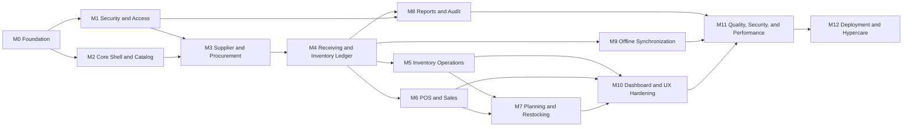

# Development Roadmap

## 1. Purpose

This roadmap sequences delivery of the Predictive Inventory System from project setup through controlled production deployment. It follows the engineering rules in `CLAUDE.md`: inventory correctness, security, auditability, observable operations, and safe offline behavior take precedence over feature velocity.

Complexity is relative to this project:

| Complexity | Meaning |
| --- | --- |
| Low | Isolated capability with limited cross-domain effects. |
| Medium | Multiple screens or services with established patterns and moderate integration. |
| High | Cross-domain workflow, policy enforcement, transactional data integrity, or substantial UX complexity. |
| Very High | Foundational architecture, financial/inventory-impacting behavior, offline synchronization, or release-critical operational work. |

## 2. Delivery Principles

- A milestone completes only when its acceptance criteria, tests, documentation, observability, and role behavior are complete.
- Work may proceed in parallel only when dependencies are satisfied and the work does not create incompatible contracts or schema assumptions.
- No feature that changes stock, sales, approvals, or planning data is released without transactions, authorization, audit trail, error behavior, and reversal or correction design.
- Schema, API, frontend, operations, and documentation changes are delivered as one compatible slice.
- Each milestone ends with a demonstrable production-like workflow, not merely completed screens or endpoints.

## 3. Roadmap Overview

## 4. Milestone 0 — Project Foundation and Delivery Platform

**Estimated complexity:** Very High

### Goals

- Establish a secure, repeatable development and deployment foundation for separate React and Laravel applications.
- Convert architecture, database, API, frontend, and operational documentation into an enforceable repository baseline.
- Ensure every later milestone can run tests, apply safe migrations, and report failures consistently.

### Features

- Repository layout for `frontend`, `backend`, documentation, environment templates, and local orchestration.
- Laravel 12 and PHP 8.4 baseline with MySQL configuration, strict SQL modes, UTC convention, queue configuration, and health checks.
- React, TypeScript, Vite, Tailwind, React Router, TanStack Query, Zustand, React Hook Form, Zod, Framer Motion, Recharts, and Dexie baseline.
- CI pipeline for formatting, linting, static analysis, unit and feature tests, dependency scanning, secret scanning, and build verification.
- Environment configuration policy, encrypted secret handling, local developer setup, and production-safe log configuration.
- Initial database migration discipline, seed-data policy, test factories, and backup/restore runbook skeleton.

### Dependencies

- Approved repository access, environment ownership, CI provider, and deployment target.
- Availability of MySQL, queue, cache, object storage or approved file storage, and managed secret configuration.
- Review and adoption of `CLAUDE.md`, `SYSTEM_ARCHITECTURE.md`, `DATABASE_DESIGN.md`, `REST_API_SPECIFICATION.md`, `FRONTEND_ARCHITECTURE.md`, and `LARAVEL_ARCHITECTURE.md`.

### Acceptance criteria

- A new developer can set up the complete local environment using documented steps without undocumented manual changes.
- Frontend and backend build, lint, type-check, and test successfully in CI from a clean checkout.
- The application uses UTC, `utf8mb4`, strict MySQL modes, and non-production credentials by default.
- Secrets, `.env` files, generated output, database dumps, and local tokens are excluded from version control and detected by CI.
- A sample forward-only migration applies cleanly in a disposable environment and a tested backup restore procedure exists.
- Health, structured logging, correlation IDs, and safe exception handling are available before business features begin.

## 5. Milestone 1 — Identity, Authentication, RBAC, and Branch Scope

**Estimated complexity:** High

### Goals

- Establish secure user identity, session management, Owner/Manager/Staff access, and mandatory branch scope.
- Provide the authorization foundation required by every subsequent business workflow.

### Features

- Laravel Sanctum secure cookie-session authentication, CSRF flow, sign in, sign out, password reset, session invalidation, and rate limiting.
- User lifecycle management: creation, activation, deactivation, profile update, role assignment, branch assignment, and session revocation.
- Roles, permissions, user-role assignments, role-permission assignments, and user-branch scope.
- Laravel policies, gates, request middleware, branch-context validation, and frontend access guards.
- Authentication, access-change, failed-sign-in, and authorization-denial audit events.
- Initial account and branch administration interfaces.

### Dependencies

- Milestone 0 complete.
- Approved password policy, session duration, account-lockout policy, initial Owner identity, and initial branch definitions.

### Acceptance criteria

- An unauthenticated user cannot access protected routes or API resources.
- Owner, Manager, and Staff receive only the capabilities defined by the approved RBAC matrix.
- Every protected read and write enforces branch scope server-side; changing a URL or request body cannot escape scope.
- Session rotation, logout, password reset, account deactivation, and password-change invalidation work as documented.
- Authorization denials return safe `403` responses and write auditable security events.
- Frontend route guards improve navigation but API policy tests prove that they are not relied upon for security.

## 6. Milestone 2 — Application Shell, Design System, and Catalog Foundation

**Estimated complexity:** High

### Goals

- Deliver the shared enterprise application experience and master data required for operational workflows.
- Establish stable frontend patterns before high-risk transactional features are added.

### Features

- Responsive application shell with header, branch selector, sidebar, mobile drawer, profile menu, sync-status area, page headers, and error boundaries.
- Shared design system: typography, color tokens, buttons, inputs, dialogs, tables, cards, badges, skeletons, empty states, toasts, and accessibility primitives.
- Category, unit-of-measure, product, product-unit conversion, and product availability management.
- Typed API service layer, query-key factories, request/response error mapping, standard pagination, URL filter state, and form patterns.
- Product search and barcode lookup foundation for future POS and receiving use.

### Dependencies

- Milestone 0 and Milestone 1 complete.
- Approved product taxonomy, unit-of-measure conventions, SKU policy, barcode policy, and tax defaults.

### Acceptance criteria

- All authenticated pages share consistent navigation, responsive layout, focus behavior, loading state, empty state, error state, and access-denied treatment.
- Product creation validates unique SKU, unit compatibility, category, tracking flags, tax rate, and approved purchase/sales units.
- Product records can be retired without breaking historical references.
- Product lookup is branch-aware where availability is shown and does not present stale browser data as final stock truth.
- The shared component library meets the documented accessibility and visual requirements.
- Catalog APIs, resources, policies, tests, and frontend forms use consistent typed contracts.

## 7. Milestone 3 — Supplier Management and Purchase Order Workflow

**Estimated complexity:** High

### Goals

- Establish controlled procurement planning and supplier master-data management.
- Implement a complete purchase-order lifecycle without yet changing stock.

### Features

- Supplier organization and contact management with deactivation and duplicate prevention.
- Supplier-product sources with supplier SKU, cost, currency, lead time, minimum order quantity, order multiple, and preferred-source policy.
- Purchase-order draft creation, editing, line calculations, submission, approval, rejection, mark ordered, cancellation, and closing.
- Purchase-order approval history, threshold policy integration, segregated approval rules, status transitions, and immutable document snapshots.
- Procurement list/detail UI, server-side filtering, status badges, audit records, and notification hooks for required approval.

### Dependencies

- Milestone 1 and Milestone 2 complete.
- Approved purchase-order numbering scheme, approval thresholds, independent-approval policy, supplier data, and commercial currency rules.

### Acceptance criteria

- A PO has explicit draft, submitted, approved, ordered, partially received, received, cancelled, and closed state behavior.
- Only authorized users can create, update, submit, approve, reject, order, cancel, or close a PO.
- A requester cannot approve their own PO when segregation-of-duties policy requires independent approval.
- Line totals, document totals, tax, discount, currency, and snapshots are calculated and stored consistently.
- Invalid supplier, product, unit, quantity, cost, and state transitions are rejected by the API and surfaced clearly in the UI.
- Every material procurement action produces an audit record and a testable policy decision.

## 8. Milestone 4 — Goods Receiving and Core Inventory Ledger

**Estimated complexity:** Very High

### Goals

- Establish the authoritative stock-change pipeline and current balance projection.
- Make receiving accurate, traceable, idempotent, and reversible through controlled processes.

### Features

- Goods-receipt drafts, line validation, partial receipt, accepted and rejected quantities, source delivery reference, and configured lot/serial/expiry fields.
- Receipt posting and reversal workflows with idempotency keys.
- Append-only inventory movement ledger and product-branch inventory-balance projection.
- Atomic updates to receipt state, PO-line receipt totals, PO status, movement records, balance projection, audit records, and idempotency records.
- Inventory monitoring list, product availability endpoint, receiving detail screens, and reconciliation job foundation.
- Stock locking, optimistic concurrency, duplicate delivery detection, and safe failure handling.

### Dependencies

- Milestone 3 complete.
- Approved receiving tolerance, direct-receipt policy, rejection reason codes, inventory movement types, and traceability requirements.

### Acceptance criteria

- Posting a receipt produces exactly one authoritative movement per accepted stock line and updates the correct branch balance in one transaction.
- Partial receipts accurately update PO-line received quantity and PO status without allowing unauthorized over-receipt.
- Posted receipts cannot be edited. Corrections create an authorized reversal or compensating record linked to the original receipt.
- Retrying a post with the same idempotency key cannot double-receive goods.
- Every inventory movement contains product, branch, type, signed quantity, source reference, actor, effective time, and correlation ID.
- Inventory-balance projections reconcile to movement history in automated tests and scheduled reconciliation controls.

## 9. Milestone 5 — Inventory Operations and Control Workflows

**Estimated complexity:** High

### Goals

- Enable controlled inventory monitoring, adjustment, movement investigation, and correction workflows.
- Make every exception explainable and auditable.

### Features

- Product-branch inventory monitoring with available, on-hand, reserved, incoming, ROP status, and freshness metadata.
- Inventory adjustment draft, reason codes, line preview, approval threshold, posting, rejection, and reversal workflow.
- Movement history search, filtering, source-document drill-down, and correlation-ID traceability.
- Balance reconciliation reporting and governed operational exception handling.
- Inventory alert-ready hooks after adjustment or reconciliation events.

### Dependencies

- Milestone 4 complete.
- Approved adjustment reason codes, approval thresholds, negative-stock policy, cost-impact policy, and correction procedures.

### Acceptance criteria

- Adjustments require a reason, accountable actor, non-zero signed quantity, before/after preview, and policy-based approval.
- Only authorized users can approve or post threshold-controlled adjustments, and users cannot approve their own adjustment when policy forbids it.
- Posting or reversing an adjustment is atomic, idempotent, and creates linked immutable movements and audit events.
- Movement history is read-only, server-paginated, branch-scoped, and traceable to source records.
- Direct edits to movement history and posted stock facts are impossible through both UI and API.
- Reconciliation mismatches create visible, auditable operational exceptions instead of silent balance changes.

## 10. Milestone 6 — POS and Sales Recording

**Estimated complexity:** Very High

### Goals

- Deliver a fast, keyboard-friendly sales workflow that protects stock and commercial rules at finalization.
- Convert finalized sales into immutable sales, payment, inventory, audit, and reporting facts.

### Features

- POS product search, barcode scan behavior, branch-aware availability advisory, cart, unit selection, quantity adjustment, price display, discount policy, and payment capture within scope.
- Server-side sale finalization with idempotency, stock revalidation, price/tax calculation, authorized override, payment-total validation, and inventory movement posting.
- Sales history, sale detail, receipt representation, void, refund, and reversal workflows.
- POS cart local state and controlled offline draft behavior, without offline finalization until the offline milestone explicitly enables it.
- POS error, pending, insufficient-stock, duplicate-submit, and authorization feedback.

### Dependencies

- Milestone 1, Milestone 2, and Milestone 4 complete.
- Approved price, tax, discount, payment-method, receipt-numbering, void, refund, and negative-stock policies.

### Acceptance criteria

- The POS flow is usable with keyboard and touch, and product lookup responds without loading unbounded catalog data.
- Sale finalization atomically creates sale header, sale lines, payment allocations, inventory movements, balance updates, idempotency record, and audit event.
- The server rejects insufficient stock, invalid product units, inactive products, unauthorized discount/price overrides, and mismatched payment totals.
- Retrying a sale request with the same idempotency key returns the original durable outcome and never duplicates stock reduction.
- Completed sales cannot be edited; voids and refunds create authorized compensating records and movements.
- Sales and movement history reconcile for representative sales, void, and refund scenarios.

## 11. Milestone 7 — Forecasting, EOQ, ROP, and Restocking

**Estimated complexity:** Very High

### Goals

- Deliver explainable planning intelligence based on finalized demand and controlled supplier/product policy inputs.
- Surface replenishment risk without creating autonomous purchase decisions.

### Features

- SMA forecast run creation, scheduling, input period validation, cold-start handling, immutable run snapshots, manual planning overrides, and forecast detail visualization.
- EOQ calculation service and history with annual demand, ordering cost, holding cost, formula version, validation, rounding, supplier constraints, and recommendation display.
- Product-branch reorder policies, safety stock, lead-time source, ROP recalculation, and ROP explanation.
- Scheduled and event-triggered restocking alert evaluation, severity ranking, deduplication, acknowledgement, assignment, resolution, dismissal, and event history.
- Planning dashboard panels, forecast-versus-demand views, and controlled drill-down to inventory and procurement.

### Dependencies

- Milestone 4, Milestone 5, and Milestone 6 complete.
- Approved demand policy, forecast period grain, SMA minimum/maximum windows, lead-time convention, holding-cost definition, safety-stock policy, alert severity policy, and manual override rules.

### Acceptance criteria

- SMA uses only finalized, complete demand periods and excludes voided, cancelled, duplicate, test, and incomplete transactions under the approved demand policy.
- Products with insufficient history show a transparent cold-start status rather than fabricated forecast values.
- EOQ validates compatible positive inputs, records formula and input snapshot, and does not automatically generate purchase orders.
- ROP equals lead-time demand plus safety stock using a single documented time convention and authorized supplier/product lead-time source.
- Alerts are generated when available inventory reaches policy threshold, are deduplicated per product-branch policy, and retain lifecycle history.
- Forecast, EOQ, ROP, and alert results are explainable in UI and reports with scope, cutoff, assumptions, and calculation version.

## 12. Milestone 8 — Reports, Exports, Audit Trail, and Governance

**Estimated complexity:** High

### Goals

- Deliver governed visibility into inventory, procurement, sales, planning, and user actions.
- Ensure reports and exports are reproducible, access-controlled, and operationally safe.

### Features

- Report catalog, server-side inventory, sales, purchase order, receiving, supplier, forecast, EOQ, ROP, restocking, and audit report definitions.
- Paginated interactive report views with filters, scope metadata, chart/table parity, and drill-down behavior.
- Queued PDF, CSV, and XLSX export generation, authorization-at-download, expiration, retention, and export audit records.
- Append-only audit trail for authentication, authorization denial, create/update, approvals, inventory actions, exports, synchronization, and settings changes.
- Audit search and detail views with structured redacted before/after values, correlation IDs, and governed access.
- System settings management with type validation, scope, sensitive-value redaction, concurrency, and audit controls.

### Dependencies

- Milestone 1 and Milestone 4 complete; Milestones 3, 5, 6, and 7 provide their respective report sources.
- Approved report catalog, retention policy, export formats, access classifications, file storage, and settings registry.

### Acceptance criteria

- Every report declares branch scope, filters, timezone, currency, generated time, source cutoff, freshness, and access classification.
- Large reports paginate and aggregate on the server; browser memory is not used as an unbounded report engine.
- PDF, CSV, and XLSX exports are queued when necessary, authorized at creation and download, expired by policy, and fully audited.
- Audit entries are append-only, redacted, schema-versioned, searchable by authorized roles, and distinguish domain history from audit history.
- Audit viewing and export actions themselves generate audit events.
- System settings cannot be changed without correct type, permission, version, and audit evidence.

## 13. Milestone 9 — Offline Synchronization

**Estimated complexity:** Very High

### Goals

- Provide controlled continuity for approved offline workflows without weakening server authority or causing duplicate inventory facts.
- Make pending, stale, rejected, and conflicted state transparent to users.

### Features

- Dexie IndexedDB schema, versioned migrations, user/branch scoping, approved reference-data cache, and retention policy.
- Immutable operation queue with client operation ID, idempotency key, payload version, dependency chain, actor and branch context, payload hash, status, and timestamps.
- Synchronization coordinator with connectivity detection, deterministic ordering, exponential backoff with jitter, retry classification, and query refresh after acceptance.
- Backend sync intake, idempotency integration, per-operation result, operation-status endpoint, conflict payload, and audit records.
- Sync status UI, cached-data age, pending queue count, rejected operation state, conflict resolver, and logout clearing behavior.
- Approved offline workflow enablement only after each workflow has documented server validation and conflict behavior.

### Dependencies

- Milestone 1, Milestone 2, Milestone 4, and the relevant online workflow milestones complete.
- Approved offline workflow list, maximum offline duration, retention policy, conflict-resolution policy, local-data classification, and reauthentication policy.

### Acceptance criteria

- No offline-created record is shown as finalized before server acceptance.
- Every queued operation has a unique immutable operation ID and idempotency key; replay cannot duplicate a sale, receipt, adjustment, or other approved action.
- Dependent operations remain blocked until prerequisites succeed; retryable failures use bounded backoff; validation, authorization, and conflicts stop automatic retry.
- Conflict UI presents local and server data, authorship/time context, permitted resolution actions, and records the final outcome in the audit trail.
- Logout, user switch, and authorization loss clear user-scoped local state safely and cannot expose one user’s cached data to another.
- Offline capabilities are blocked for workflows requiring live stock truth, live approval, fresh permission, or server-only validation.

## 14. Milestone 10 — Enterprise Dashboard, UX Hardening, and Responsive Completion

**Estimated complexity:** High

### Goals

- Turn completed operational capabilities into an efficient role-aware decision surface.
- Complete responsive, accessible, and consistent workflow design across all delivered features.

### Features

- Dashboard KPI cards, critical exception strip, sales and inventory trends, low-stock queue, pending procurement, recent sales, forecast summary, and sync health.
- Role- and branch-aware dashboard composition, data freshness labels, chart accessibility equivalents, and drill-down to matching filtered tables.
- Table density controls, responsive row/detail patterns, mobile navigation, mobile action bars, and touch-first interaction review.
- Consistent empty, loading, skeleton, error, unauthorized, conflict, and offline states across all modules.
- Form usability, focus management, keyboard navigation, visual hierarchy, status vocabulary, and reduced-motion review.

### Dependencies

- Milestones 2 through 9 complete for their respective data sources.
- Approved dashboard KPI definitions, default date ranges, priority ordering, design tokens, and accessibility review criteria.

### Acceptance criteria

- Dashboard opens with actionable exceptions before noncritical visualizations and clearly labels scope, currency, timezone, and freshness.
- Every KPI and chart has an authorized drill-down with equivalent filter context and an accessible numerical or tabular representation.
- Critical workflows work at desktop, tablet, and mobile breakpoints without unreadable tables, hidden primary actions, or keyboard traps.
- Loading, empty, error, offline, conflict, and access-denied states are designed and tested for each route.
- Interface components use the shared design system and semantic statuses consistently; no role or status is communicated by color alone.
- Accessibility testing verifies WCAG 2.2 AA expectations for focus, contrast, forms, dialogs, charts, keyboard operation, and screen-reader labels.

## 15. Milestone 11 — Quality, Performance, Security, and Operational Readiness

**Estimated complexity:** Very High

### Goals

- Verify the complete system against enterprise quality, security, performance, reliability, and recovery requirements.
- Resolve cross-feature defects before production rollout.

### Features

- Full automated test matrix: Laravel unit/feature/integration tests, frontend component/hook/flow tests, contract tests, and end-to-end tests.
- Performance profiling, query-plan review, indexing verification, N+1 prevention, route/chunk analysis, load testing, and queue throughput evaluation.
- Security review: authorization matrix testing, dependency and secret scanning, CSRF/session controls, rate limits, headers, export access, sensitive data redaction, and access review.
- Observability completion: structured logs, error tracking, metrics, alerts, dashboards, correlation IDs, queue failure monitoring, sync failure monitoring, and reconciliation alerts.
- Disaster recovery verification: backups, restore exercise, retention checks, migration rehearsal, rollback/forward-fix plans, and incident runbooks.
- User acceptance testing with realistic transaction, supplier, stock, and reporting data in a production-like environment.

### Dependencies

- Milestones 1 through 10 functionally complete.
- Production-like non-sensitive test data, load profile, security review ownership, monitoring platform, backup storage, and UAT participants.

### Acceptance criteria

- Critical paths have automated coverage for authorization, idempotency, concurrency, inventory movements, receipt posting, sale finalization, reversal, forecasting, reports, and offline conflicts.
- Performance budgets are met or documented with an approved remediation plan for dashboard, POS lookup, inventory monitoring, receiving, exports, and synchronization.
- Query plans and indexes are reviewed for high-volume tables; no known critical N+1 query or unbounded collection load remains.
- Security tests demonstrate that roles, branch scope, exports, sensitive settings, session behavior, and audit access fail closed.
- Restore testing meets documented recovery objectives and demonstrates usable recovery evidence.
- All priority defects from UAT, security review, and operational-readiness review are resolved or explicitly accepted by accountable owners.

## 16. Milestone 12 — Production Deployment, Rollout, and Hypercare

**Estimated complexity:** High

### Goals

- Deploy the system safely, migrate operational use in controlled stages, and stabilize production behavior.
- Provide accountable support and measurable readiness before declaring general availability.

### Features

- Deployment runbook, environment promotion checklist, safe migration sequence, feature-flag and rollback/forward-fix plan.
- Production configuration verification for HTTPS, secrets, sessions, queues, workers, scheduler, cache, storage, alerts, backups, and error tracking.
- Initial master-data import or controlled data entry, user provisioning, role assignment, branch setup, and access verification.
- Role-specific onboarding materials for Owner, Manager, and Staff; operating procedures for receiving, adjustments, POS, alerts, reports, and sync conflicts.
- Phased rollout plan, support escalation path, incident response ownership, daily reconciliation checks, and hypercare metrics review.
- Post-launch review and prioritized stabilization backlog.

### Dependencies

- Milestone 11 complete with release approval.
- Production infrastructure approval, data migration sign-off, trained users, support coverage, communication plan, and named incident owners.

### Acceptance criteria

- Production deployment follows an approved runbook and verifies health checks, migrations, queue workers, scheduler, monitoring, backups, and access controls.
- Initial users can authenticate with their assigned role and branch scope; unauthorized access tests fail in production configuration.
- Inventory opening balances, master data, and historical data imported in scope reconcile to approved source records before operational cutover.
- Receiving, POS, adjustment, forecasting, reporting, export, audit, and synchronization smoke tests succeed in production under controlled conditions.
- Dashboards, logs, alerting, queue monitoring, sync monitoring, backup status, and reconciliation controls are actively observed during hypercare.
- Hypercare exit is approved only after stable operational metrics, reconciled inventory, resolved critical defects, and documented ownership transfer.

## 17. Cross-Milestone Release Gates

### Data-integrity gate

- Every stock-affecting feature uses a transaction, immutable movement, source reference, idempotency behavior where needed, and audit record.
- Reconciliation demonstrates that balance projections match movement history for representative and failure cases.
- Historical records are corrected by compensating facts, not direct edits or deletes.

### Security gate

- Authentication, authorization, branch scope, sensitive-data redaction, rate limits, CSRF, session lifecycle, and audit records are tested for the delivered scope.
- No privileged endpoint or export path relies on frontend checks.
- No secrets, credentials, raw payment data, or user-scoped offline data are exposed through logs, responses, or browser persistence.

### UX and accessibility gate

- Every delivered route has loading, empty, error, unauthorized, and responsive states.
- Forms have client and server validation feedback, keyboard flow, visible focus, and duplicate-submit protection.
- High-impact actions have confirmation, explicit status, and recovery guidance without concealing authorization or validation failures.

### Operational gate

- New queues, caches, jobs, alerts, reports, and integrations have documented ownership, observability, retry policy, retention, and runbook coverage.
- Database changes have safe migration, index, backfill, recovery, and deployment plans.
- Documentation is updated in the same release as behavior, API, data, or operational changes.

## 18. Roadmap Governance

- The engineering lead maintains milestone status, dependency changes, risks, and approved scope adjustments.
- Product and operations owners validate acceptance criteria using production-like scenarios before a milestone is marked complete.
- Security, database, and DevOps reviewers participate in gates that affect access, data integrity, migration, caching, queues, retention, and deployment.
- Any request to reorder milestones must preserve their stated dependencies and identify the resulting changes to risk, testing, and operational readiness.
- No milestone is complete because implementation exists. It is complete only when the system behavior is verified, supportable, documented, and accepted.
