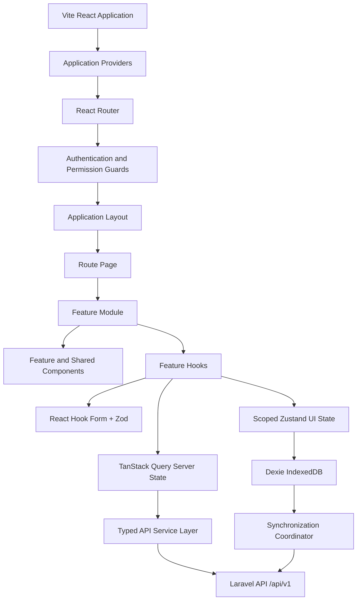
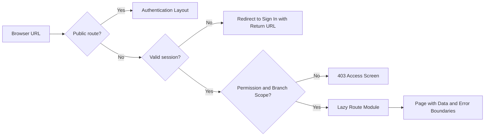
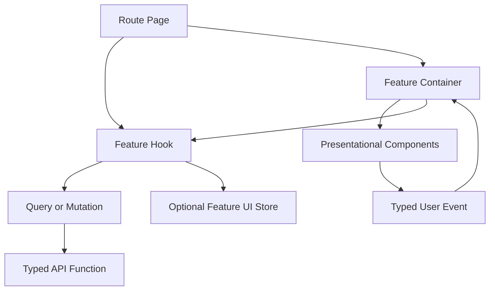
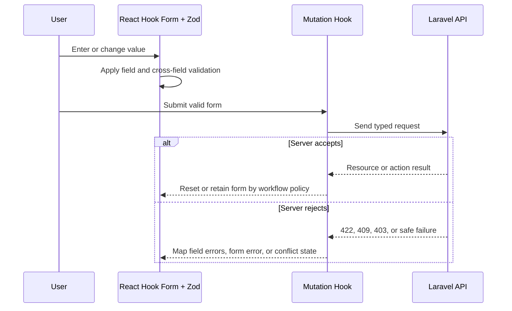
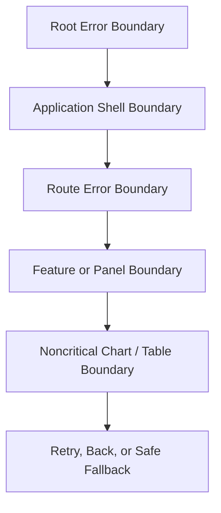
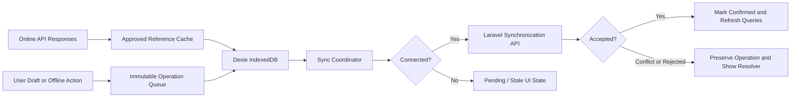

# Frontend Architecture

## 1. Purpose

This document defines the React frontend architecture for the Predictive Inventory System. It establishes a feature-first, TypeScript-first application that is responsive, accessible, observable, and safe for inventory operations in both connected and approved offline scenarios.

The frontend is a separate deployable application. It consumes the Laravel `/api/v1` contract, but it never becomes the system of record for authorization, stock availability, financial values, or finalized transactions.

## 2. Architectural Principles

- Organize by business capability so product, purchasing, receiving, inventory, POS, planning, reports, and audit changes remain locally understandable.
- Keep route pages thin. Pages compose data, route state, guards, and layout; feature components render; hooks coordinate behavior; typed service modules perform HTTP work.
- Classify all state before implementation: server state, URL state, form state, local component state, cross-route UI state, or durable offline state.
- Treat backend validation and authorization as authoritative. Frontend validation improves user feedback and prevents avoidable requests.
- Keep operational context visible: active branch, freshness, sync status, permission state, selected date range, and scope of displayed data.
- Optimize high-frequency workflows—POS lookup, stock search, receiving, adjustments, and dashboard exceptions—before decorative interactions.

## 3. Application Topology



### Provider responsibilities

| Provider or boundary | Responsibility |
| --- | --- |
| Query client provider | Query cache defaults, retries, invalidation, mutation behavior, and persisted-query policy where approved. |
| Router provider | Route matching, route-level lazy loading, redirect intent, and URL state. |
| Authentication provider | Current session, session refresh, sign-out coordination, and route-level authentication state. |
| Branch-context provider | Current authorized branch selection and safe reset when branch or user changes. |
| Theme and accessibility provider | Approved visual preferences and reduced-motion behavior. |
| Error boundary hierarchy | Feature isolation, retry controls, correlation ID display, and safe recovery navigation. |
| Sync-status provider | Connectivity signal, pending-operation count, last successful sync, and conflict visibility. |

## 4. Folder Structure

The frontend uses a feature-first structure. Directory names communicate ownership and must not become generic dumping grounds.

```text
frontend/
├── public/
├── src/
│   ├── app/
│   │   ├── providers/
│   │   ├── router/
│   │   ├── layouts/
│   │   ├── guards/
│   │   ├── config/
│   │   └── App.tsx
│   ├── features/
│   │   ├── auth/
│   │   ├── dashboard/
│   │   ├── users/
│   │   ├── branches/
│   │   ├── catalog/
│   │   │   ├── products/
│   │   │   ├── categories/
│   │   │   └── units-of-measure/
│   │   ├── suppliers/
│   │   ├── purchase-orders/
│   │   ├── goods-receiving/
│   │   ├── inventory/
│   │   │   ├── balances/
│   │   │   ├── adjustments/
│   │   │   └── movements/
│   │   ├── pos/
│   │   ├── sales/
│   │   ├── forecasting/
│   │   ├── replenishment/
│   │   ├── reports/
│   │   ├── audit-trail/
│   │   ├── settings/
│   │   └── synchronization/
│   ├── shared/
│   │   ├── api/
│   │   ├── components/
│   │   ├── design-system/
│   │   ├── hooks/
│   │   ├── lib/
│   │   ├── types/
│   │   ├── constants/
│   │   ├── accessibility/
│   │   └── testing/
│   ├── offline/
│   │   ├── db/
│   │   ├── queue/
│   │   ├── sync/
│   │   └── migrations/
│   ├── styles/
│   ├── assets/
│   ├── main.tsx
│   └── vite-env.d.ts
├── tests/
│   ├── e2e/
│   └── fixtures/
├── index.html
└── vite.config.ts
```

### Feature module contract

Each feature may contain the following folders when justified by the feature’s size:

```text
features/purchase-orders/
├── api/             Typed endpoint functions and response mappers
├── components/      Feature-specific visual components
├── hooks/           Query, mutation, and orchestration hooks
├── pages/           Route-level pages owned by the feature
├── schemas/         Zod request and filter schemas
├── types/           Feature domain and UI contracts
├── state/           Feature-local Zustand store only when needed
├── utils/           Focused pure feature helpers
└── tests/           Component, hook, and behavior tests
```

Feature modules must not import another feature’s internal files. Cross-feature collaboration occurs through public feature exports, shared contracts, route navigation, or backend APIs. For example, POS may consume a public product lookup contract but must not import catalog page components or private catalog hooks.

## 5. Routing Architecture

Routes are centralized, declarative, and grouped by application shell and permission boundary. Each route declares its title, lazy module, required authentication, required permission, and branch-context requirement.



### Route groups

| Route group | Representative paths | Required capability |
| --- | --- | --- |
| Public authentication | `/login`, `/forgot-password`, `/reset-password` | None |
| Workspace shell | `/dashboard` | Authenticated, dashboard access |
| Administration | `/users`, `/branches`, `/settings` | Corresponding administration permissions |
| Catalog and suppliers | `/products`, `/categories`, `/units`, `/suppliers` | Corresponding master-data permissions |
| Procurement | `/purchase-orders`, `/purchase-orders/:id`, `/goods-receipts`, `/goods-receipts/:id` | Procurement and receiving permissions |
| Inventory | `/inventory`, `/inventory/movements`, `/inventory/adjustments`, `/inventory/adjustments/:id` | Inventory permissions |
| POS and sales | `/pos`, `/sales`, `/sales/:id` | POS and sales permissions |
| Planning | `/forecasting`, `/replenishment`, `/replenishment/policies/:id` | Forecasting and planning permissions |
| Intelligence and governance | `/reports`, `/audit-trail` | Report or audit access |
| Synchronization | `/sync-conflicts` | Authenticated user with pending conflict scope |

### Routing rules

- Use stable, kebab-case route paths and opaque public identifiers in parameter segments.
- Keep filter, sort, pagination, selected report dates, and non-sensitive tab state in URL search parameters.
- Preserve return URL and list context after record detail, creation, cancellation, and recoverable errors.
- Route guards may hide inaccessible routes but API authorization remains the final authority.
- A branch-required route blocks data fetching until an authorized active branch is selected.
- Route-level pages render explicit loading, empty, error, denied, and offline states.
- Do not place complex stateful workflows entirely in modal routes; use a full page for receiving, purchase-order editing, POS, and detailed adjustment operations.

## 6. Shared Components and Design System

Shared components are reusable, accessible primitives with stable interfaces. They are visually consistent but contain no feature-specific business policy.

### 6.1 Design-system layers

| Layer | Examples | Rule |
| --- | --- | --- |
| Primitives | Button, Input, Select, Checkbox, Badge, Tooltip, Spinner | Own semantic HTML, focus behavior, variants, and accessible labeling. |
| Composites | FormField, ConfirmDialog, DataTable, DateRangePicker, EmptyState, ErrorPanel | Combine primitives for repeatable interaction patterns. |
| Layout | AppShell, PageHeader, SectionCard, SideNav, TopBar, ResponsiveStack | Establish visual hierarchy and responsive structure. |
| Data display | Currency, Quantity, DateTime, StatusBadge, TrendIndicator, ChartContainer | Format data consistently without performing business calculations. |
| Feedback | Toast, InlineAlert, Skeleton, ProgressIndicator, OfflineBanner, SyncStatus | Communicate state without hiding critical action requirements. |

### 6.2 Shared-component rules

- Components use semantic HTML first and expose typed props, accessible labels, keyboard support, and visible focus behavior.
- A component must not call a feature endpoint, inspect a role name, calculate stock, or determine approval policy.
- Visual variants use approved Tailwind design tokens and a controlled variant API; arbitrary one-off styling is not allowed in shared primitives.
- Shared components accept semantic states such as `status="warning"`, not feature concepts such as `purchaseOrderIsLate`.
- Modal components trap focus, restore focus on close, support Escape where safe, and never nest.
- Tables expose screen-reader labels, sorting state, row identity, empty states, and responsive alternatives for data-dense workflows.

## 7. Feature Organization and Component Communication

The frontend uses unidirectional data flow. Server facts flow from queries into pages and components. User actions flow upward through typed callbacks, feature hooks, or mutation functions. No component reaches sideways into unrelated feature state.



### Communication rules

- Parent-to-child communication uses explicit typed props. Child-to-parent communication uses semantic callback props such as `onLineQuantityChange`, not callbacks that expose local implementation details.
- Feature hooks own query composition, mutation state, user-facing workflow transitions, and derived display state.
- Presentation components receive already-authorized, display-ready values and do not execute remote requests.
- Cross-route communication uses URL state, invalidated server queries, or a narrowly scoped Zustand store. It never uses prop drilling through unrelated layout layers.
- Event buses, global mutable singletons, and direct DOM coordination are prohibited for product workflows.
- Feature-local pure calculation helpers may derive previews but must name their unit and assumption and remain subordinate to backend confirmation.

## 8. State Management

### 8.1 State ownership matrix

| State type | Owner | Examples | Persistence |
| --- | --- | --- | --- |
| Server state | TanStack Query | Products, balances, PO details, reports, permissions, dashboard metrics | In-memory cache; optionally approved limited persistence |
| URL state | React Router search parameters | Filters, dates, sorting, pagination, active table tab | Browser history and sharable URL |
| Form state | React Hook Form | Product edit, receipt draft, adjustment form, sign in | Memory during workflow; deliberate draft only where approved |
| Local UI state | `useState` / reducer | Open panel, local selection, expanded row, transient view mode | Memory only |
| Cross-route UI state | Zustand | Navigation preference, POS cart draft, current branch UI selection, sync indicator | Memory; selective non-sensitive persistence |
| Durable offline state | Dexie IndexedDB | Cached reference data, queued operation records, sync metadata | Versioned IndexedDB |

### 8.2 State rules

- Do not duplicate a server fact in Zustand, local state, or form state unless it is an explicit user draft with documented reconciliation behavior.
- Do not cache permissions, pricing, or availability indefinitely. These values refresh at session, branch, and workflow boundaries.
- Reset all user-scoped memory and persisted stores on logout, user change, authorization revocation, and branch-context change where state is branch-specific.
- Store only non-sensitive UI preferences and approved work-in-progress data in browser persistence.
- Model workflow state using discriminated unions or explicit state machines when outcomes can be pending, queued, conflicted, rejected, completed, or reversed.

## 9. TanStack Query Usage

TanStack Query owns all remote server state. Query key design, freshness, invalidation, mutation behavior, and error treatment are part of the feature’s API contract.

### 9.1 Query-key policy

Query keys are centralized by feature and include every input that changes resource identity: active branch, record ID, filters, sort, pagination, date range, and applicable view mode.

| Query family | Identity inputs | Freshness policy |
| --- | --- | --- |
| Current session | User session identity | Refetch at application focus and after auth-relevant mutation |
| Product and supplier lists | Filters, page, sort | Moderate stale time; invalidate after catalog or source mutation |
| Inventory balances and POS lookup | Branch, product/search, availability filter | Short stale time; refetch on focus and after stock-affecting mutation |
| Purchase orders and receiving | Branch, status, ID | Moderate stale time; invalidate related detail and lists after workflow transition |
| Dashboard | Branch and date range | Short-to-moderate stale time; visible freshness label |
| Forecasts, EOQ, ROP, alerts | Branch, product/policy, run ID | Refresh after relevant calculation or input changes |
| Reports and audit | Scope, filters, page, sort | No unbounded cache; retain only current navigational context |

### 9.2 Query rules

- Every query declares a feature-owned key factory. Ad hoc array keys are not permitted in page JSX.
- A query is disabled until required identity inputs, including authorized branch context, are present.
- Keep previous valid page data during a parameter transition when it avoids layout jumps, while visibly indicating background refresh.
- Cancel obsolete in-flight requests when query identity changes to prevent stale results overwriting current context.
- Query cache data is not mutated directly except through a documented optimistic update that has safe rollback behavior.
- Sensitive responses are not persisted. Logout clears user-scoped cache data before navigation.

### 9.3 Mutation rules

- Mutations call typed feature API services and expose pending, success, error, and retry states to the owning workflow.
- Use `Idempotency-Key` for receipt posting, sale finalization, synchronization, and other retry-prone writes. Preserve the key until the server resolves that operation.
- On success, invalidate or update all affected detail, list, dashboard, balance, alert, and report queries; do not depend on component remounting.
- Use optimistic updates only for safe, reversible, non-authoritative UI actions. Do not optimistically finalize sales, post receipts, or change inventory balances.
- Convert `409` conflicts into a visible conflict workflow. Convert `422` validation errors into form-level and field-level feedback.

## 10. Zustand Usage

Zustand is limited to cross-route client state that cannot be represented better by TanStack Query, URL state, a form, or local component state.

### 10.1 Approved stores

| Store | Purpose | Persisted | Reset trigger |
| --- | --- | --- | --- |
| `uiPreferencesStore` | Theme, table-density, motion preference, navigation presentation | Yes, non-sensitive | User logout or user change |
| `branchContextStore` | Selected authorized branch and selection status | Optional, validated on startup | Logout, revoked branch, user change |
| `posCartStore` | Local unsaved cart and safe draft metadata for one branch | Approved local persistence only | Sale completion, cancel, logout, branch change |
| `syncStatusStore` | Connectivity, queue counts, last sync time, conflict count | No; derived from Dexie | App startup and sync events |
| `notificationUiStore` | Toast and transient display queue | No | Automatically after dismissal |

### 10.2 Store rules

- Split stores by bounded purpose. A global application store that mixes user, forms, server data, and UI behavior is prohibited.
- Expose selector-friendly atomic values and actions to avoid broad rerenders.
- Persisted store schemas require a version and migration policy. Invalid or stale persisted data is discarded safely.
- Stores cannot decide authorization or inventory truth. They may retain a local draft only until the API confirms or rejects it.
- Actions must be named as user or workflow intent, not low-level field mutation where a domain action is clearer.
- POS cart data is branch-bound, user-bound, and timestamped. It is never treated as a completed sale.

## 11. Forms, Validation, and User Feedback

React Hook Form and Zod provide ergonomic client validation. Laravel remains authoritative and may return stricter validation or business-invariant failures.



- Zod schemas live in their feature module and mirror, but do not duplicate as an authority, Laravel Form Request rules.
- Field labels, descriptions, and error messages use domain language and state how to correct the input.
- Cross-field rules validate quantities, unit selection, payment totals, date ranges, lead time, and planning constraints before submission.
- Forms prevent duplicate submission during pending mutation. Recoverable errors preserve entered data.
- High-impact actions use clear confirmation controls, but confirmation never substitutes for authorization or backend validation.
- Server field errors map to their exact input; non-field business errors appear in a form-level alert with correlation ID when available.

## 12. Error Boundaries and Failure Handling

Error boundaries isolate failures so a noncritical widget cannot collapse a whole operational workspace.



### Boundary levels

| Level | Covers | Recovery behavior |
| --- | --- | --- |
| Root | Application boot, provider setup, fatal route failure | Safe application error screen, support request ID, reload and sign-out options. |
| Shell | Navigation and authenticated workspace | Preserve session if safe; show recovery route without losing access to sign out. |
| Route | One page and route loader | Retry route, return to prior list, retain URL context where safe. |
| Feature panel | Dashboard widget, report visualization, side panel | Keep the rest of the page functional; offer panel retry. |
| Async request | Query or mutation failure | Inline error, form error, conflict resolver, or toast according to the workflow. |

### Error-handling rules

- Do not use error boundaries for expected validation, authorization, offline, or conflict outcomes; represent those as explicit application states.
- Show safe messages, error classification, and request correlation ID for unexpected failures. Never reveal stack traces or secrets.
- Retry controls are offered only when retry is safe. Mutation retries preserve idempotency keys.
- A `401` triggers controlled session refresh or sign-in redirect. A `403` renders an access-denied state rather than looping navigation.
- A `409` opens or links to the relevant conflict resolution experience; it never silently overwrites the server record.

## 13. Offline Strategy

Offline mode is a constrained operational capability. It improves continuity in approved workflows but never converts the browser into the authority for stock or business state.

### 13.1 Local data architecture



### 13.2 IndexedDB domains

| Local collection | Contents | Retention and security |
| --- | --- | --- |
| `referenceCache` | Approved product lookup, units, categories, authorized supplier reference, branch metadata | Versioned; scoped by user and branch; expires according to freshness policy. |
| `operationQueue` | Immutable operation ID, idempotency key, payload version, branch, dependency, payload hash, timestamps, status | Retain until accepted, dismissed after resolution, or policy expiry. |
| `syncMetadata` | Last successful sync, cursor/version, retry schedule, current queue counts | Non-sensitive; reset with user state. |
| `conflicts` | Local/server values, structured refusal, permitted resolution actions | Access-controlled to originating user; cleared after auditable resolution or retention expiry. |
| `posDrafts` | Approved user and branch-bound cart drafts | No finalized payment credentials, secrets, or authoritative stock values. |

### 13.3 Offline rules

- The UI always displays connectivity, queued-operation count, last successful sync, and cached-data age in approved offline workflows.
- An offline operation is marked `pending` until server acceptance. Local success feedback must state that synchronization remains pending.
- Every queued mutation has a UUID operation ID, idempotency key, payload version, user and branch context, creation time, dependency metadata, and deterministic ordering.
- The coordinator uses exponential backoff with jitter for retryable failures. Validation, authorization, and conflict outcomes stop automatic retry.
- Operations with unmet dependencies do not replay. Logging out clears user data in IndexedDB according to recovery policy and never leaks it to the next user.
- Workflows requiring current stock truth, live approval, fresh permissions, or server-only policy are blocked offline with a clear explanation.

## 14. Lazy Loading and Code Splitting

Route modules are the primary code-splitting boundary. Heavy feature utilities load only when a user enters the route or activates the optional capability.

### 14.1 Required split points

| Split point | Loading strategy | Reason |
| --- | --- | --- |
| Authentication screens | Separate public chunk | Avoid loading application shell for signed-out users. |
| Each top-level feature route | Route-level lazy module | Keeps initial workspace bundle limited to shell and dashboard requirements. |
| POS | Dedicated feature chunk, selectively preloaded for authorized POS users | Contains search and cart behavior not needed by every role. |
| Receiving and PO editor | Dedicated workflow chunks | Complex forms and contextual tables are not initial-load requirements. |
| Reports, charts, PDF/export UI | Lazy child chunks | Charting and export status UI are noncritical initial payload. |
| Forecasting and replenishment | Dedicated planning chunk | Calculation displays and data visualizations are specialized. |
| Conflict resolver | Load only on sync conflict | Rare recovery capability. |
| Large dialogs and drawers | Dynamic import on activation | Avoid hidden, eagerly rendered interaction code. |

### 14.2 Lazy-loading rules

- Provide a route-specific skeleton or loading state that preserves page hierarchy and accessibility.
- Do not lazy-load the active branch selector, authentication controls, core error boundary, or essential navigation needed to recover from a failed route.
- Prefetch a likely next route only after critical current-workflow resources are loaded and network conditions permit it.
- Lazy chunks must not create circular imports or duplicate feature ownership.
- Recharts and other heavy visualization dependencies load with the dashboard or report panel that uses them, not globally.

## 15. Performance Optimization

Performance is evaluated using production-representative data, devices, and network conditions. Optimization preserves correctness, accessibility, and observability.

### 15.1 Rendering performance

- Use component composition and narrow Zustand selectors to prevent broad rerenders.
- Profile before applying `memo`, `useMemo`, or `useCallback`; memoization without evidence is not a standard pattern.
- Virtualize only genuinely large result sets and retain keyboard navigation, focus behavior, selection semantics, and row measurement reliability.
- Avoid rendering hidden tabs, large dialogs, or expensive charts until users activate them.
- Use stable keys derived from resource identity, never list indexes for mutable operational rows.

### 15.2 Network and query performance

- Paginate every material collection server-side and send only visible fields required for the current view.
- Debounce type-ahead lookup requests, cancel stale requests, and set a minimum search length for expensive catalog search.
- Use purpose-specific endpoints for POS lookup, availability, dashboard cards, and detail views rather than overfetching a large generic resource.
- Configure retry behavior by operation type: safe reads may retry; stock and financial writes require idempotency-aware explicit retry.
- Invalidate precisely after writes to avoid both stale data and unnecessary refetch storms.

### 15.3 Asset and visual performance

- Use Vite production chunk analysis to monitor initial bundle, route chunk, and duplicated dependency size.
- Serve optimized images only where business value justifies them; icons use the approved icon system rather than ad hoc image assets.
- Respect reduced-motion preferences and avoid layout-shifting animations, loops, and decorative motion on operations screens.
- Skeletons match the final layout and are removed promptly on data, empty state, or error state.

### 15.4 Operational performance budgets

| Workflow | Frontend expectation |
| --- | --- |
| Application shell | Navigation and authenticated shell become interactive without waiting for noncritical feature chunks. |
| POS lookup | Keyboard input remains responsive; stale searches are cancelled; current result scope is visible. |
| Inventory table | Server-paginated result renders without loading an unbounded inventory set. |
| Sale and receipt finalization | Pending state prevents duplicate interaction; server outcome is unambiguous and recoverable. |
| Dashboard | Critical exception cards load before noncritical charts; freshness shown for all KPIs. |
| Report export | Export creation is nonblocking; queued status and later download are visible. |
| Offline sync | Queue changes and conflicts update the visible sync status without blocking unrelated safe navigation. |

## 16. Testing and Observability Expectations

- Component tests verify semantic rendering, keyboard interactions, loading, empty, error, denied, and disabled states.
- Hook tests verify query-key identity, mutation invalidation, retry behavior, and mapping of structured API failures.
- Feature-flow tests cover POS finalization, receipt posting, adjustment approval, forecast execution, report export, and conflict recovery using deterministic API fixtures.
- End-to-end tests validate authentication, role boundaries, branch scope, responsive behavior, and the most critical online/offline transitions.
- Client error reporting includes release version, route, safe user/branch context, request ID, and error boundary location; it never records credentials, tokens, or sensitive form values.
- Performance monitoring records web-vital trends, route-load timing, query error rates, sync failures, and client-side exceptions for production releases.

## 17. Non-Negotiable Frontend Boundaries

- The frontend must never directly alter inventory balances, movement history, approval state, audit records, or finalized sales outside the documented API workflow.
- No React component may make raw HTTP calls in JSX, bypass typed API services, or infer permission from a visible menu item.
- No local cache, POS draft, offline queue, or optimistic update may be presented as finalized until the Laravel API confirms it.
- No sensitive authentication token, secret, raw payment data, or unrestricted business record is stored in localStorage or IndexedDB.
- No feature may introduce a global catch-all state store, shared helper directory for domain logic, or cross-feature import of private internals.
- Frontend changes that affect offline behavior, role access, data freshness, synchronization conflicts, calculation display, or stock workflows must update this document and the relevant API and engineering documentation.
