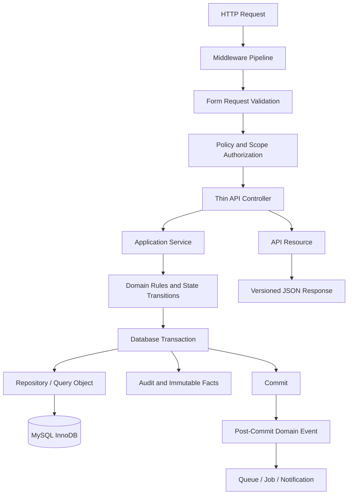
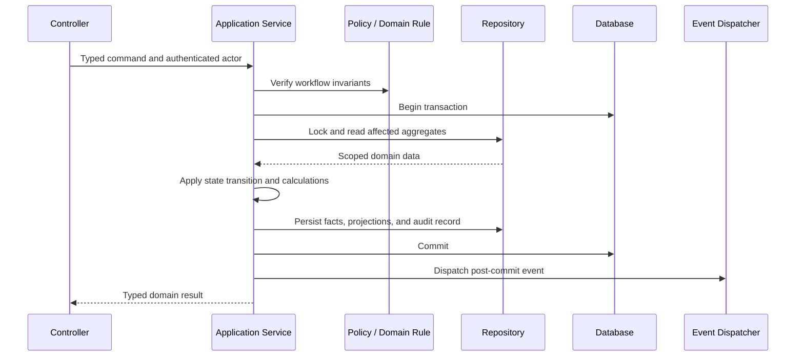
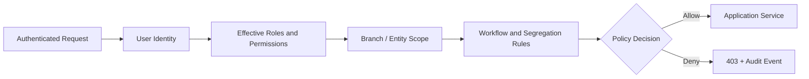
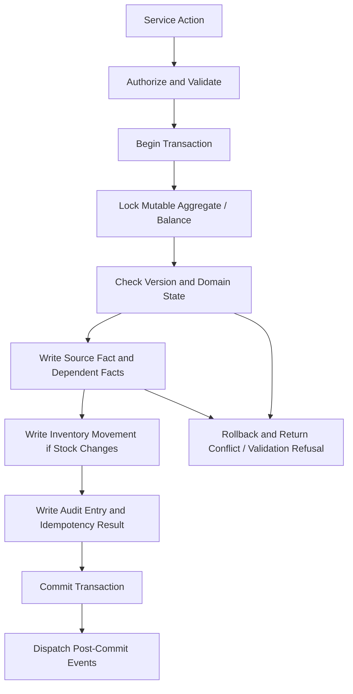

# Laravel Architecture

## 1. Purpose

This document defines the Laravel 12 backend architecture for the Predictive Inventory System. It establishes a modular-monolith API that preserves inventory integrity, enforces least-privilege access, supports audited business workflows, and safely executes deferred operational work.

Laravel is the authoritative business layer. The React application, IndexedDB cache, reports, alerts, and dashboard projections consume or present backend-owned facts but never replace the Laravel domain services and MySQL transactions that finalize operations.

## 2. Architectural Model

The backend uses an inward dependency model. HTTP delivery and framework integration are outer layers; application services own workflows; domain rules own invariants; repositories isolate complex persistence access; MySQL retains durable facts.



### Core rules

- Controllers orchestrate request flow only: authorize, validate, call an application service, and return an API Resource.
- Application services execute named business actions and own transactional boundaries, idempotency, state transition checks, and side-effect dispatch.
- Models represent persistence and relationships but do not become a home for multi-aggregate workflow policy.
- Repositories are introduced for complex, reusable, scope-sensitive persistence queries. They are not mandatory wrappers around every model.
- Events and asynchronous handlers run only after the initiating transaction commits.
- All stock changes use the inventory service and create immutable inventory movements in the same transaction.

## 3. Folder Organization

The backend is organized by bounded domain and responsibility. The structure remains a single Laravel application while preventing unrelated modules from coupling through controllers or catch-all helpers.

```text
backend/
├── app/
│   ├── Domains/
│   │   ├── Identity/
│   │   │   ├── Actions/
│   │   │   ├── Models/
│   │   │   ├── Policies/
│   │   │   ├── Repositories/
│   │   │   └── Services/
│   │   ├── Catalog/
│   │   │   ├── Models/
│   │   │   ├── Repositories/
│   │   │   ├── Services/
│   │   │   └── Rules/
│   │   ├── Procurement/
│   │   │   ├── Events/
│   │   │   ├── Models/
│   │   │   ├── Policies/
│   │   │   ├── Repositories/
│   │   │   └── Services/
│   │   ├── Inventory/
│   │   │   ├── Events/
│   │   │   ├── Models/
│   │   │   ├── Repositories/
│   │   │   ├── Services/
│   │   │   └── ValueObjects/
│   │   ├── Sales/
│   │   ├── Planning/
│   │   ├── Reporting/
│   │   ├── Synchronization/
│   │   └── Governance/
│   ├── Http/
│   │   ├── Controllers/Api/V1/
│   │   ├── Middleware/
│   │   ├── Requests/Api/V1/
│   │   └── Resources/Api/V1/
│   ├── Jobs/
│   ├── Listeners/
│   ├── Notifications/
│   ├── Exceptions/
│   ├── Support/
│   └── Providers/
├── bootstrap/
├── config/
├── database/
│   ├── factories/
│   ├── migrations/
│   └── seeders/
├── routes/
│   ├── api.php
│   ├── console.php
│   └── channels.php
├── tests/
│   ├── Feature/
│   ├── Unit/
│   └── Integration/
└── storage/
```

### Folder ownership

| Area | Owns | Must not contain |
| --- | --- | --- |
| `Domains/*/Models` | Eloquent mappings, casts, relationships, local persistence behavior | Cross-domain workflow orchestration or HTTP concerns |
| `Domains/*/Services` | Application actions, transactional workflows, domain invariants | View formatting or raw request parsing |
| `Domains/*/Repositories` | Reusable complex queries and persistence access | Authorization policy or state-transition rules |
| `Http/Controllers/Api/V1` | Endpoint orchestration and Resource selection | Inventory calculations, direct multi-model writes, unbounded queries |
| `Http/Requests/Api/V1` | Request shape and semantic validation | Database workflow mutations or authorization bypass |
| `Http/Resources/Api/V1` | Stable response contracts | Query execution or hidden lazy-loading |
| `Jobs`, `Listeners`, `Notifications` | Asynchronous and post-commit effects | Transactional business-state ownership |
| `Support` | Cross-cutting technical primitives with explicit ownership | A generic domain-logic dumping ground |

## 4. Domain Modules

| Module | Primary ownership | Important invariants |
| --- | --- | --- |
| Identity | Users, roles, permissions, sessions, branch assignments | Access is deny-by-default; branch scope is explicit. |
| Catalog | Products, categories, units, product units, supplier sources | SKU and unit conversion integrity; master records retire rather than disappear. |
| Procurement | Suppliers, POs, approvals, receiving | Legal PO transitions; receipt quantities and approval separation. |
| Inventory | Balances, adjustments, movements, reconciliation | Every stock change creates an append-only movement atomically. |
| Sales | POS finalization, sales, lines, payments, refunds, voids | Completed sales are immutable; idempotent finalization; stock is revalidated. |
| Planning | SMA, EOQ, ROP, reorder policies, alerts | Inputs, formula versions, and outputs are explainable snapshots. |
| Reporting | Read models, exports, report definitions | Authorization at run and download; server-side aggregation. |
| Synchronization | Offline operation intake, idempotency, conflicts | Deterministic replay; no silent conflict resolution. |
| Governance | Audit, settings, notifications, retention | Audit is append-only and sensitive payload is redacted. |

## 5. Service Layer

Services represent business actions, not generic model utilities. A service method communicates one outcome in the language of the business and receives typed command data rather than an unbounded HTTP Request object.



### Service responsibilities

- Enforce business invariants even when called by a console command, queue job, synchronization handler, or HTTP controller.
- Validate state transitions: a draft purchase order may be submitted, a posted receipt may not be edited, and a completed sale may only be corrected through a controlled reversal path.
- Establish one transaction boundary for related durable facts, including source document, inventory movement, balance projection, idempotency result, and audit entry.
- Accept actor, branch context, correlation ID, and idempotency context where the action is operationally significant.
- Return a domain result or expected business refusal. Unexpected faults use exceptions and are handled centrally.
- Dispatch notifications, exports, alert evaluation, and recalculation work only after commit.

### Required service actions

| Domain | Representative application actions |
| --- | --- |
| Identity | Create user, change access assignment, deactivate user, revoke sessions. |
| Catalog | Create product, change approved units, retire supplier source. |
| Procurement | Create PO draft, submit PO, record approval decision, mark ordered, post receipt, reverse receipt. |
| Inventory | Create adjustment draft, approve adjustment, post adjustment, create reversal, reconcile balances. |
| Sales | Finalize sale, void sale, issue refund, validate price override. |
| Planning | Run SMA forecast, save manual planning override, calculate EOQ, recalculate ROP, evaluate alert. |
| Reporting | Request export, authorize download, expire export. |
| Synchronization | Receive operation batch, apply idempotent operation, record conflict resolution. |
| Governance | Change setting, write audit entry, redact governed payload. |

## 6. Repository Layer

Repositories and query objects are used when persistence logic is complex, reused, performance-sensitive, or needs a strict interface to protect domain services from query-builder details.

### Repository rules

- A repository returns only data within the caller’s authorized branch and entity scope. Scope criteria are explicit arguments, never hidden global state.
- Repositories use eager loading intentionally and expose pagination, sort, filters, locks, and projections in their contracts.
- Services use repositories to obtain aggregates for mutation with the appropriate lock strategy; controllers do not construct domain write queries.
- Report, dashboard, and audit queries may use dedicated read repositories or query objects optimized for aggregation and pagination.
- Repositories do not approve records, decide permissions, calculate forecast policy, or emit events.
- Do not create empty one-method repositories that merely forward to an Eloquent model without adding a boundary or reusable query value.

### Query classes and read models

Use dedicated read query classes for high-volume or shaped reads such as inventory monitoring, POS product lookup, dashboard cards, movement history, reports, and audit search. They may return DTOs or read projections rather than mutable model graphs. Read queries must document their indexes, selected fields, scope inputs, and pagination strategy.

## 7. Policies and Authorization

Laravel policies and gates are the enforcement point for resource and action authorization. Frontend route guards are informational; no endpoint depends on them for protection.



### Policy requirements

- Every protected resource action has an explicit policy or gate. Default behavior is denial.
- Policies evaluate permissions, active account, branch assignment, resource ownership, workflow status, and separation-of-duties requirements.
- A Manager can act only within assigned capabilities and branch scope; an Owner’s broad visibility does not permit audit bypass or unlogged changes.
- Approval policies prevent a requester from being the sole approver when configured thresholds require independent review.
- Policies are invoked in controllers and repeated inside application services for critical state transitions or non-HTTP entry points.
- Authorization denials are logged as audit events without revealing hidden resource existence to unauthorized callers.

## 8. Middleware

Middleware implements cross-cutting HTTP controls before a controller invokes the domain layer.

| Middleware concern | Responsibility |
| --- | --- |
| Sanctum authentication | Validates the secure first-party session. |
| CSRF protection | Validates browser write requests under cookie-session authentication. |
| Request correlation | Accepts or creates request and correlation IDs; attaches them to log context and response headers. |
| Content negotiation | Requires JSON API requests and safe response content types. |
| Rate limiting | Applies endpoint and identity-sensitive limits to authentication, search, export, and write workflows. |
| Branch context | Validates requested branch selection is present and assigned before branch-scoped action proceeds. |
| Idempotency | Reserves, replays, or refuses a retry-prone write based on actor, operation scope, key, and canonical request hash. |
| Security headers | Applies transport, content security, clickjacking, and other approved response headers. |
| Audit context | Provides safe actor, request, source IP, user agent, and correlation metadata for services. |

Middleware must not own domain transitions or independently mutate stock, sales, purchase orders, receipts, or planning data. It prepares and protects the request lifecycle; services execute the business action.

## 9. Validation

Form Requests define HTTP request shape, primitive validation, field normalization, and authorization entry. Domain services enforce cross-aggregate and time-of-commit invariants.

### Validation layers

| Layer | Examples | Failure outcome |
| --- | --- | --- |
| Request shape | Required fields, types, UUIDs, dates, decimal strings, maximum lengths | `422 VALIDATION_FAILED` with field errors |
| Local semantic | Positive quantities, currency code, unique line numbers, valid date ranges | `422` with actionable message |
| Authorization | Permission, branch scope, ownership, approval authority | `403 FORBIDDEN` |
| Domain invariant | Available stock, PO status, receipt tolerance, no duplicate finalization, formula inputs | `409` for state/version conflicts or `422` for invalid business input |
| Database integrity | FK, unique, check, and transaction constraints | Mapped centrally to safe `409` or `422`; never leaked as SQL errors |

### Validation rules

- Form Requests never trust client-calculated totals, balances, approval state, or permissions.
- Monetary and quantity inputs are parsed to exact decimal value objects or validated canonical strings before calculation.
- Request normalization is explicit and non-destructive; meaningful free-text notes are not silently transformed.
- Validation messages name the affected business field and correction, not internal database constraints.
- Validation rules are tested for boundary cases, malformed input, and cross-field relationships.

## 10. API Resources

Laravel API Resources are the only outward mapping layer for API data. They stabilize the frontend contract as models, relationships, and database schema evolve.

### Resource rules

- Resources return public IDs, stable field names, ISO timestamps, decimal strings, currency codes, authorized links, and `version` for mutable aggregates.
- Resources use explicit relation loading and never trigger hidden lazy loads while serializing a collection.
- Summary, detail, and action-result resources are separate when their data shapes differ materially.
- Sensitive values such as cost, tax identifiers, contact data, audit metadata, and configuration settings are included only when policy authorizes them.
- Collection resources include pagination and scope/freshness metadata through the standardized API envelope.
- Resources do not calculate business decisions; they format a result already produced by services or read queries.

## 11. Database Transactions and Concurrency

Transactions protect multi-record workflows. Every write that changes stock, commercial totals, finalized records, approval state, planning policy, or audit history is explicitly bounded.



### Transaction rules

- Post receipt, final sale, adjustment, reversal, and stock reservation operations use database transactions and appropriate row locking on the affected balance and source aggregate.
- A transaction includes document state, line facts, inventory movement, balance projection, audit record, and idempotency record where applicable.
- External HTTP calls, email delivery, PDF generation, and long-running report work do not occur inside a database transaction.
- Inventory movements are append-only. A reversal inserts a linked equal-and-opposite movement; it never edits the original row.
- Optimistic concurrency uses aggregate `row_version`; stale user updates receive `409 VERSION_CONFLICT` with safe current-context guidance.
- Database deadlocks are retried only for idempotent, transaction-safe actions. Retried writes preserve their idempotency key and audit correlation.
- Failed transactions leave no partial balance, movement, audit, or document state behind.

## 12. Events and Listeners

Events describe facts that have already committed. They decouple follow-on work from critical transaction latency without allowing listeners to become hidden owners of transactional state.

| Event family | Example facts | Listener responsibilities |
| --- | --- | --- |
| Identity | User access changed, session revoked | Clear affected caches, write secondary security notification. |
| Procurement | PO approved, receipt posted, receipt reversed | Refresh incoming supply projection, evaluate planning alerts, notify relevant roles. |
| Inventory | Movement posted, adjustment approved, reconciliation mismatch | Refresh projections, schedule monitoring recalculation, create governed exception alert. |
| Sales | Sale completed, sale voided, refund completed | Refresh demand projections, dashboard metrics, and replenishment evaluation. |
| Planning | Forecast completed, EOQ calculated, ROP recalculated, alert changed | Notify assigned planners and invalidate derived caches. |
| Reporting | Export completed, export failed, export expired | Notify requester and remove expired file. |
| Synchronization | Operation accepted, conflicted, rejected | Update sync audit and make resolution status available. |

### Event rules

- Events are dispatched after commit, not before it.
- Event payloads contain stable IDs, correlation ID, scope, and minimal safe context; listeners load current data as needed.
- Listeners must be idempotent and safe when delivered more than once.
- A listener failure cannot roll back an already committed sale, receipt, adjustment, or audit event.
- Events are not used as an invisible substitute for a required synchronous invariant. Critical document and movement writes remain in the initiating service transaction.

## 13. Queues and Background Jobs

Queues handle long-running, retryable, or noninteractive work. Jobs must have a clear ownership, idempotency boundary, timeout, retry policy, observability fields, and safe failure behavior.

### Job categories

| Job | Trigger | Idempotency and result |
| --- | --- | --- |
| Generate report export | Export request committed | One export resource; output stored once and authorized at download. |
| Run forecast | Scheduled or authorized user request | Forecast run ID is the idempotency scope; immutable run items are persisted. |
| Calculate EOQ / ROP | Policy, cost, demand, or supplier change | Snapshot inputs and mark calculation validity; does not create PO. |
| Evaluate restocking alerts | Schedule and material inventory/planning event | Deduplicates active alert per policy and records lifecycle event. |
| Inventory reconciliation | Scheduled operational control | Compares projection to movements and raises controlled exception. |
| Expire export | Schedule | Deletes external object only after retention checks; updates export status. |
| Cleanup expired idempotency and sync metadata | Schedule | Removes only data beyond approved retention and never needed audit evidence. |
| Send notification | Post-commit event | Deduplicated delivery with channel status. |

### Queue rules

- Jobs receive identifiers and command context, not hydrated request objects or browser payloads.
- Jobs are idempotent by business key and use a unique lock where duplicate execution could cause duplicate alerts, exports, or notifications.
- Retry only transient operational failures. Validation, authorization, and conflict outcomes are terminal and recorded clearly.
- Jobs have bounded timeout and backoff with jitter. Failed jobs enter observable failure handling with correlation ID and safe error code.
- Queue workers use least-privilege credentials and cannot bypass policies or direct database integrity controls.
- The scheduler is the only owner of recurring evaluation cadence. Individual controllers do not create ad hoc periodic work.

## 14. Notifications

Notifications communicate actionable outcomes without becoming the only record of a business event. The source document, alert, audit log, and workflow state remain authoritative.

### Notification policy

| Trigger | Audience | Delivery behavior |
| --- | --- | --- |
| Restocking alert reaches risk threshold | Assigned manager and authorized planning roles | Deduplicated while alert remains active; escalation follows configured policy. |
| Purchase order awaits approval | Eligible approvers | One actionable notification per required stage; expiration after resolution. |
| Goods receipt exception or reversal | Procurement and inventory managers | Immediate in-app notification; external channel only if configured. |
| Export completed or failed | Requesting user | In-app notice with authorized download or safe failure status. |
| Offline operation conflict | Originating user | Persistent in-app conflict notice until resolved or dismissed under policy. |
| Security-sensitive access change | Affected user and authorized owner | Timely notification with audit reference; no secret values. |

Notification content includes a concise action, entity identity, status, and safe deep link. It never includes credentials, raw payment data, secret configuration, or unredacted sensitive audit fields. Delivery failures are logged and observable but do not change committed business state.

## 15. Caching

Caching improves read performance only for derived, non-authoritative data. Cache entries have a named owner, scope-aware key, TTL, invalidation trigger, and observability.

### Approved cache targets

| Cache target | Key scope | Invalidation |
| --- | --- | --- |
| Permission and route capability projection | User, session/access version | Role, user, branch, or permission change; logout. |
| Product lookup reference | Branch, product search inputs, role-sensitive price scope | Product, supplier source, unit, or pricing-policy change. |
| Dashboard projections | Branch, date range, role/metric scope | Sale, receipt, movement, alert, or relevant policy event. |
| Report definitions | Role and report catalog version | Report definition or permission change. |
| Forecast/ROP display projection | Branch, product/policy, calculation version | Demand, supplier, safety stock, lead time, or calculation run change. |

### Cache rules

- Never cache a stock mutation decision, unscoped authorization decision, raw session, secret, or unredacted audit payload.
- Every key includes branch, user or role scope, locale, filters, version, and any other input that changes its result.
- Writes invalidate dependent cache entries after commit. TTL is a backstop, not the correctness mechanism.
- Cache failures degrade safely to authoritative reads; they never permit stale data to authorize a sensitive action.
- Cache hit rate, miss rate, invalidation failure, and stale-data incident metrics are monitored for material caches.

## 16. Exception Handling and Observability

Central exception handling converts known application and database conditions into safe API errors. It never reveals SQL, stack traces, file paths, credentials, or hidden record existence.

| Failure type | API treatment | Operational treatment |
| --- | --- | --- |
| Form validation | `422` with field errors | Structured warning or info log where appropriate. |
| Policy denial | `403 FORBIDDEN` | Audit denial event with safe scope context. |
| Missing scoped resource | `404 NOT_FOUND` | No unauthorized existence disclosure. |
| Stale version or illegal state | `409 CONFLICT` / `VERSION_CONFLICT` | Include correlation ID and domain-safe resolution context. |
| Duplicate idempotency retry | Replay prior accepted result or `409` on changed payload | Log idempotency decision. |
| Database integrity failure | Safe `409` or `422` mapping | Error tracking with constraint category, never raw SQL. |
| Unexpected exception | `500 INTERNAL_ERROR` | Structured error event, alerting, and correlation trace. |

Structured logs include timestamp, environment, release, request and correlation IDs, safe actor context, action, branch, entity IDs, duration, and outcome. Error tracking and metrics monitor API failure rate, slow queries, queue backlog, failed jobs, sync conflicts, reconciliation failures, and backup health.

## 17. Testing Architecture

- Unit tests cover calculation services, value objects, state transitions, domain exceptions, and pure policy rules.
- Feature tests cover versioned endpoints, request validation, API Resources, Sanctum authentication, policy denial, branch scope, and transaction behavior.
- Integration tests cover repository queries, indexing assumptions where practical, queued jobs, event/listener behavior, cache invalidation, and MySQL constraints.
- Contract tests ensure resource payloads and error envelopes remain compatible with the documented REST API.
- Critical workflows include deterministic concurrency, idempotency, partial receiving, sales finalization, reversal, forecast cold-start, EOQ invalid input, ROP missing lead time, and offline synchronization conflict cases.
- Tests never rely on production data, timing luck, unbounded external calls, or unasserted queue execution.

## 18. Non-Negotiable Backend Boundaries

- No controller, listener, notification, or queue job may directly mutate inventory balances or finalized business documents outside the owning application service.
- No code path may bypass policies, Form Request validation, transaction boundaries, audit creation, idempotency, or immutable movement creation for a stock-affecting action.
- No event listener may assume a transaction committed unless it is dispatched after commit.
- No cache, queue retry, or offline sync replay may produce duplicate sale, receipt, adjustment, movement, alert, export, or notification facts.
- No report, export, resource, log, exception, or notification may expose a secret, credential, raw payment value, unscoped supplier contact detail, or unauthorized financial information.
- Any change to a domain boundary, transaction scope, policy rule, queue behavior, cache invalidation contract, or audit guarantee updates this document, `CLAUDE.md`, and the API specification in the same change.
