# System Architecture

## 1. Purpose

Predictive Inventory System is a web-based enterprise inventory management platform for Steven Hydrotech Exponent Water Treatment and Supply Services. It provides a controlled operational system for product, supplier, procurement, receiving, stock, sales, forecasting, replenishment, reporting, and audit processes.

This document describes the target logical architecture. It establishes how the frontend, backend, database, asynchronous processing, and offline client work together while preserving the engineering controls defined in `CLAUDE.md`.

## 2. Architectural Principles

- The platform is a modular monolith: a React web application and a Laravel API are independently deployable applications connected through a versioned HTTP contract.
- MySQL is the authoritative persistence layer for operational records. Browser state, caches, charts, reports, and IndexedDB are projections or temporary working state.
- Inventory changes are domain transactions. They must be authorized, validated, committed atomically, and represented by immutable inventory movements.
- Business logic belongs to backend domain services. The frontend may perform matching calculations for immediate user guidance, but cannot finalize a business outcome.
- Every material operation is traceable through a correlation ID, authenticated actor, domain reference, and audit entry.
- The design is branch-aware. Every inventory, procurement, sales, alert, and report operation is scoped to an authorized business location.

## 3. Overall Architecture

The system separates user experience, API delivery, domain execution, persistence, and asynchronous work. The Laravel application remains the single business authority and owns all write-side validation, authorization, state transitions, and database transactions.

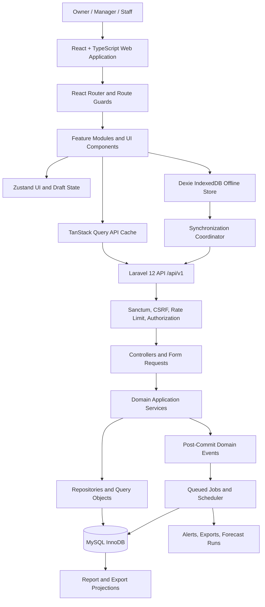

### Responsibilities by layer

| Layer | Primary responsibility | Must not own |
| --- | --- | --- |
| React frontend | User workflow, immediate validation, presentation, local drafts, and server-state consumption | Final authorization, inventory truth, or persisted business decisions |
| Laravel HTTP layer | Routing, request validation, authorization entry point, API resources, and error translation | Complex workflow policy or direct multi-table updates |
| Laravel domain services | Business invariants, state transitions, transactions, idempotency, and post-commit events | UI formatting or transport-specific concerns |
| Repositories/query objects | Efficient scoped persistence and reusable reads | Business approval or stock policy |
| MySQL | Durable facts, constraints, relationships, and transactional consistency | Presentation-specific denormalized assumptions |
| Queues and scheduler | Retriable deferred work, calculations, notifications, exports, and reconciliation | Unbounded or non-idempotent write behavior |
| IndexedDB | Approved offline reference data, drafts, and queued operations | Canonical inventory or authorization state |

## 4. Frontend Architecture

The frontend uses React, TypeScript, Vite, Tailwind CSS, React Router, TanStack Query, Zustand, React Hook Form, Zod, Framer Motion, and Recharts. It is structured by business feature rather than by technical file type alone.

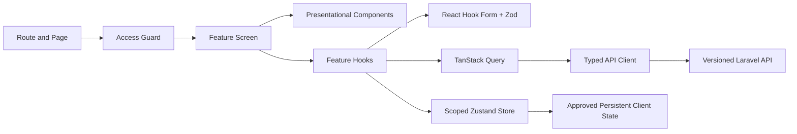

### Feature module design

Each feature owns its pages, presentational components, feature hooks, schemas, types, API client functions, and tests. Typical feature boundaries include authentication, products, categories, suppliers, purchase orders, receiving, inventory, POS, forecasting, restocking, reports, audit trail, and settings.

Shared modules contain only broadly reusable concerns: design-system components, layout, routing, API transport primitives, authentication context, error handling, and accessibility utilities. A shared module must not become a second home for feature-specific business logic.

### Client state ownership

- TanStack Query owns server state: paginated lists, record details, dashboard metrics, reports metadata, and authorized reference data.
- React Hook Form owns active form state, including touched fields, validation results, submission state, and unsaved input.
- Zustand owns small cross-route UI state such as user preferences, POS cart drafts, and sync indicators.
- URL state owns shareable filters, pagination, sorting, dates, tabs, and scoped list context.
- IndexedDB owns only explicitly approved offline data, queued operations, and versioned local schema metadata.

### Frontend data freshness

Inventory availability, POS product data, receiving context, and authorization-sensitive data use conservative freshness policies. The interface may retain previous data during background refresh, but it must label stale data when a user decision could be affected. A completed server mutation invalidates or updates every related query; it never relies on incidental rerendering.

## 5. Backend Architecture

Laravel 12 is organized as a modular monolith with explicit boundaries between delivery, application, domain, and persistence responsibilities. Controllers are thin orchestration points. Domain services execute business actions inside managed database transactions.

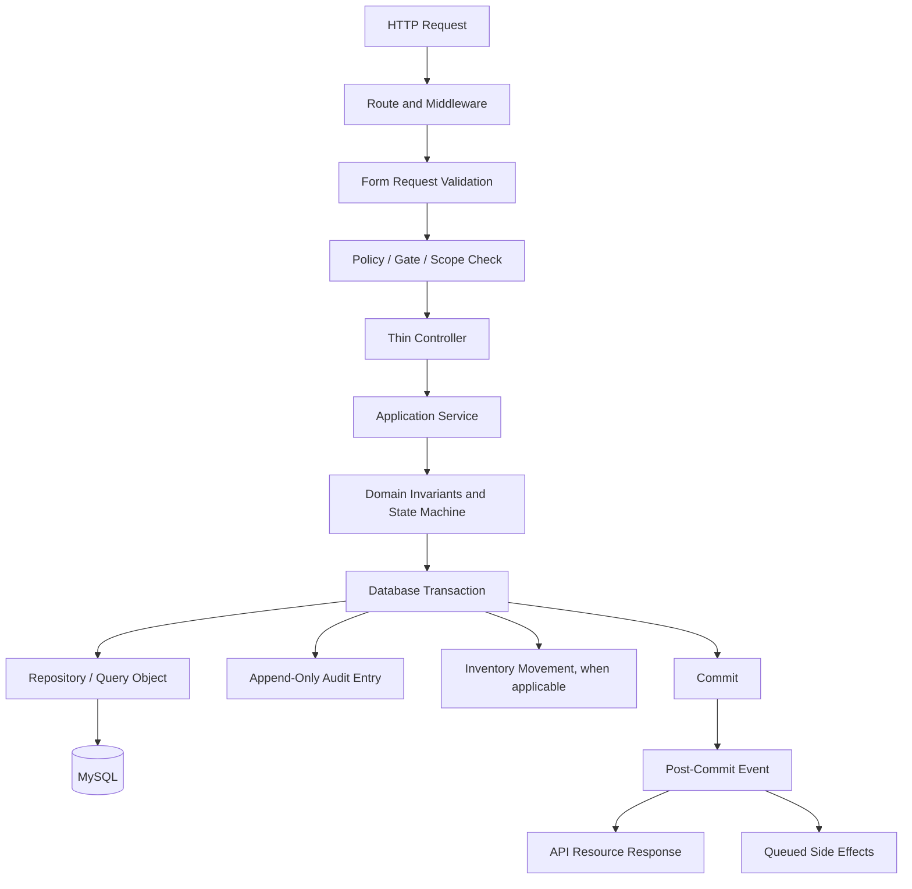

### Domain modules

The backend separates domain behavior into modules with clear ownership:

- Identity and access: users, roles, permissions, sessions, branch scope, and privileged actions.
- Catalog: products, categories, units of measure, supplier-product relationships, pricing policy, and product inventory policy.
- Procurement: suppliers, purchase orders, approval policies, order status, and expected receipts.
- Inventory: balances, reservations, adjustments, immutable movements, reconciliation, and stock monitoring.
- Sales: POS cart finalization, sales records, approved discounts, cancellations, refunds, and sale-origin movements.
- Planning: demand history, forecast runs, SMA calculations, EOQ recommendations, ROP calculations, and restocking alerts.
- Reporting: read models, aggregation, exports, report metadata, and access-controlled file delivery.
- Governance: audit records, settings, notification policy, retention, and operational controls.

### Transaction boundary

An operation that changes a business aggregate or stock position is completed within one database transaction. A receipt, sale, adjustment, reversal, approval, or settings update either commits all required facts and audit records or commits none. Side effects such as notifications, exports, and recalculation jobs are emitted only after commit and must be retry-safe.

## 6. Authentication and Authorization Flow

The first-party web application uses Laravel Sanctum with secure cookie-based sessions. Authentication establishes identity; authorization determines whether that identity can perform a particular action on a specific scoped record.

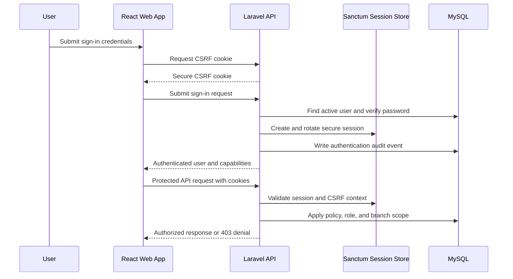

### Authorization model

Authorization is enforced server-side on every protected endpoint. Role membership alone is insufficient: policies also evaluate entity ownership, branch scope, workflow state, segregation-of-duties rules, approval thresholds, and contextual permission grants.

- Owners have governed visibility and administration across the business but cannot bypass audit controls.
- Managers operate assigned business processes and approvals within granted scope.
- Staff receive least-privilege access to assigned operational workflows and cannot access global administration or sensitive unscoped reports.
- Frontend route guards improve navigation and prevent confusing UI, but they do not replace Laravel policies.

## 7. API Flow

The API is versioned under `/api/v1`. It exposes resource-oriented reads and explicit state-transition actions. Requests and responses use stable JSON contracts with ISO 8601 UTC timestamps, ISO 4217 currency codes, documented decimal string values, machine-readable errors, and correlation IDs.

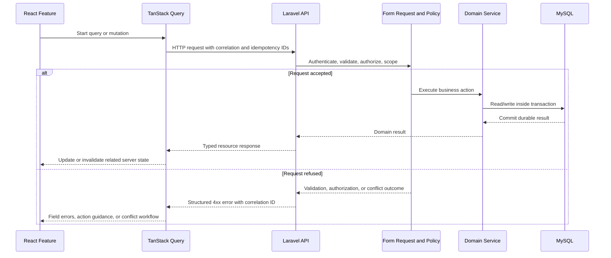

### API request rules

- Retry-prone writes, including POS sales, receipt posting, and synchronization, carry a client-generated idempotency key.
- API responses distinguish validation failures (`422`), unauthorized access (`401`), forbidden actions (`403`), missing records (`404`), rate limits (`429`), and state or version conflicts (`409`).
- List endpoints paginate on the server and return filter-aware metadata. Large reports and exports do not stream unbounded data to the browser.
- API resources shape outgoing fields. Eloquent models and internal exceptions are never returned directly.
- Every request is scoped to the current authorized branch or business context before any record is returned or mutated.

## 8. Database Interactions

MySQL with InnoDB is the source of truth for all operational records. The schema uses foreign keys, uniqueness constraints, strict SQL modes, `utf8mb4`, UTC timestamps, fixed-point decimals, and carefully selected indexes.

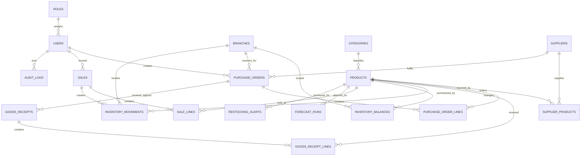

### Inventory data model

`inventory_movements` is append-only and records every stock-affecting event. Each movement contains the product, branch or location, controlled movement type, signed quantity, source reference, actor, effective timestamp, and correlation ID. Corrections use reversals or compensating adjustments; they do not edit historical movement facts.

`inventory_balances` is a performance projection of the movement history. It may be updated in the same transaction as a valid movement, but it must remain reconcilable with a movement-derived total. Reconciliation jobs detect and raise controlled exceptions if the projection diverges.

### Consistency and concurrency

- Money is stored as integer minor units or fixed-point decimals. Quantities, costs, rates, and calculations use explicit decimal precision and scale.
- Aggregate records vulnerable to concurrent editing use a concurrency token or version. A stale update receives a conflict response instead of overwriting newer work.
- Database writes that span multiple tables use a single transaction with deterministic lock ordering when stock or balances are involved.
- Reference data can be soft-deleted only when historical records require it. Transactional facts remain immutable and visible through their historical status.
- Queries include branch scope, authorization scope, and appropriate indexes. High-volume report and dashboard queries are examined with query plans.

## 9. Forecasting Engine

The forecasting engine produces transparent Simple Moving Average (SMA) demand forecasts. It is an advisory planning service, not an autonomous ordering system.

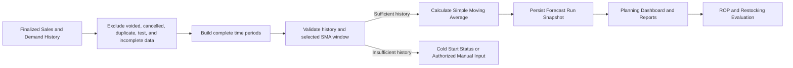

### Calculation policy

SMA uses finalized historical demand over a selected, complete period window. The demand policy defines the treatment of returns, cancellations, free goods, adjustments, and other exceptional transactions. A forecast run captures its product scope, period length, time grain, source data cutoff, model version, input summary, output, and generation timestamp.

The engine enforces minimum and maximum periods configured for the chosen reporting grain. It does not calculate a numerical SMA when fewer than two complete periods are available. When history is insufficient, the platform displays an explicit cold-start status or an authorized manual planning value with reason, expiry, and audit trail.

### Operational characteristics

- Forecast calculations use a consistent data cutoff and never mix a partially posted current period with completed historical periods.
- Historical forecast runs are immutable snapshots. Later source data corrections create a new run rather than rewriting prior outputs.
- The UI exposes the selected window, source period range, demand data, assumptions, and forecast limitations.
- Calculation jobs are repeatable, versioned, and scheduled or triggered after material demand changes.
- Recommendations feed planning views and alerts but do not create purchase orders automatically.

## 10. EOQ Engine

Economic Order Quantity (EOQ) recommends an order quantity that balances ordering and holding costs under the approved economic model.

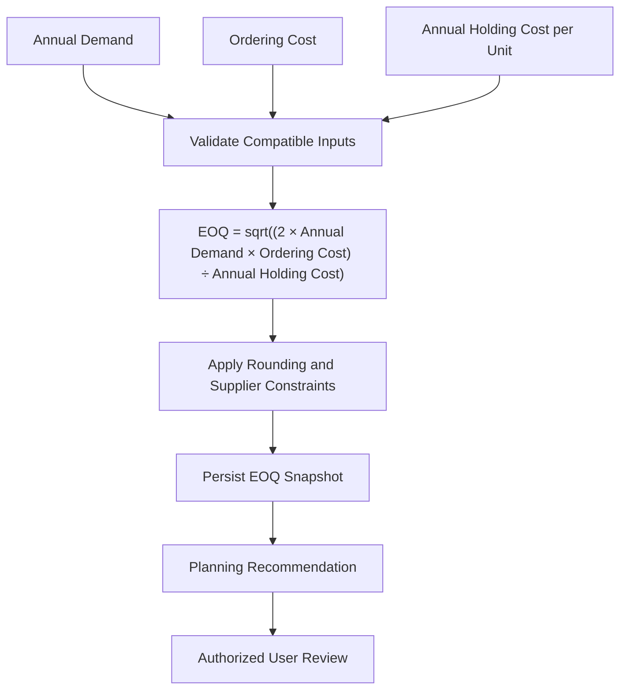

### Calculation policy

Annual demand, ordering cost, and holding cost must use compatible units and currency. Holding cost is defined consistently as annual cost per unit, either as a direct configured amount or as an approved carrying-cost rate applied to unit cost. The system refuses to calculate EOQ when inputs are missing, zero, negative, stale beyond policy, or otherwise invalid.

The raw economic result is not necessarily the final proposed order quantity. The engine applies documented rounding and surfaces supplier minimum order quantity, pack size, storage, shelf-life, cash, and operational constraints. Final purchasing decisions remain subject to authorization and purchase-order workflow.

Every EOQ result is stored as a snapshot of inputs, formula version, rounding policy, output, data cutoff, and actor or scheduler identity. Relevant product, cost, demand, or supplier changes invalidate displayed recommendations and require recalculation.

## 11. ROP Engine

The Reorder Point (ROP) engine determines when inventory should be replenished. It measures replenishment risk rather than generating an automatic purchase commitment.

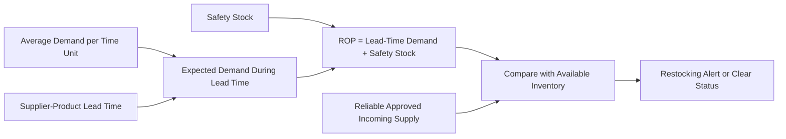

### Calculation policy

ROP equals expected demand during lead time plus safety stock. The system defines one time convention for all inputs: calendar days or business days. Supplier-product lead time takes precedence over a product default. Safety stock is non-negative and has an explicit basis, such as policy minimum, service level, or an authorized manual override.

The engine evaluates the ROP against available stock, not merely on-hand stock. Incoming purchase-order quantities may reduce risk only when their status and expected receipt date satisfy the configured reliability policy. A low-stock alert is deduplicated by product and scope but retains state-transition history.

## 12. POS Workflow

The POS flow is optimized for speed while preserving transactional integrity. A finalized sale is an atomic business event that records the sale and posts corresponding inventory movements.

```mermaid
stateDiagram-v2
    [*] --> Draft
    Draft --> Searching: Search or scan product
    Searching --> Draft: Add or update cart line
    Draft --> PendingValidation: Submit sale
    PendingValidation --> Draft: Validation or stock refusal
    PendingValidation --> AwaitingApproval: Restricted discount or override
    AwaitingApproval --> Draft: Rejected
    AwaitingApproval --> Finalizing: Approved
    PendingValidation --> Finalizing: Valid standard sale
    Finalizing --> Completed: Transaction commits
    Finalizing --> Draft: Transient failure; retry with same idempotency key
    Draft --> Cancelled: Cancel cart
    Completed --> Reversed: Authorized void or refund workflow
```

### Sale finalization

1. The user searches or scans products and creates a client-side cart draft.
2. The frontend validates basic input and displays current available stock and approved price data, marked as subject to server confirmation.
3. On submission, the client sends cart lines, branch scope, payment information if in scope, correlation ID, and idempotency key.
4. The backend authenticates the user; validates the cart, price, taxes, discounts, product status, permission, and stock availability; and locks or otherwise protects the relevant inventory rows.
5. One transaction creates the completed sale, line snapshots, payment record if applicable, negative inventory movements, balance projection changes, and audit entry.
6. After commit, the API returns the durable result and a post-commit process may refresh planning data, notifications, reports, and receipt output.

Completed sales are never overwritten. Voids, refunds, and corrections are controlled state transitions with authorization and compensating financial and inventory records. Duplicate finalization is prevented by the idempotency key.

## 13. Offline Synchronization

Offline capability is limited to approved workflows. IndexedDB enables continuity during intermittent connectivity but is not a substitute for the central database.

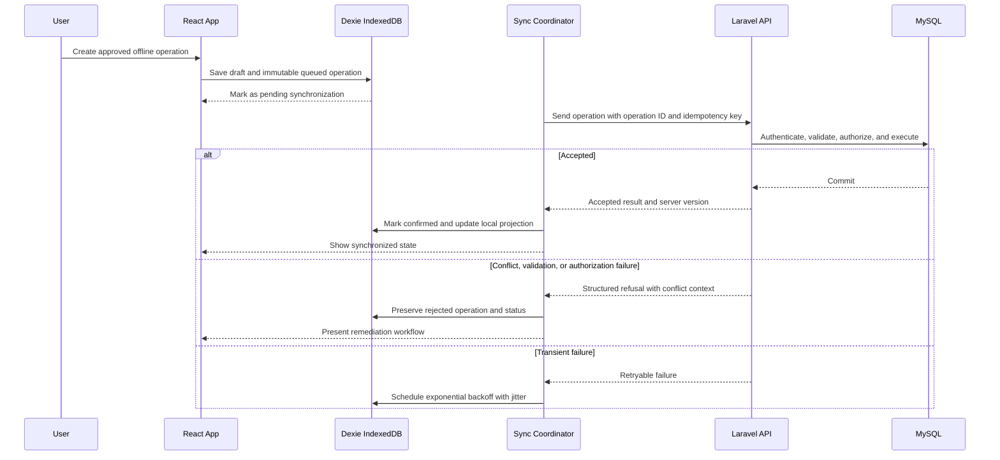

### Offline operation model

Every queued mutation has an immutable client-generated operation ID, idempotency key, payload version, actor and branch context, creation timestamp, causal dependencies, and per-operation status. Dependent operations cannot replay until their prerequisites have been acknowledged by the server.

The synchronization coordinator replays operations in deterministic order, uses exponential backoff with jitter for retryable transport failures, and stops automatic retries for validation, authorization, and conflict outcomes. The interface shows queue count, operation status, last successful synchronization time, cached-data age, and user-remediable errors.

### Conflict handling

The server uses version or concurrency checks for conflict-sensitive aggregates. It does not apply generic last-write-wins behavior to stock, financial values, finalized sales, receipts, purchase orders, or planning settings. Conflict resolution presents local and server values, authorship, timestamps, and allowed actions. The final outcome, including a dismissal, is auditable.

## 14. Reports Architecture

Reports provide governed, reproducible views of operational data. They rely on authoritative transaction records and reconciled projections, not browser-side aggregation.

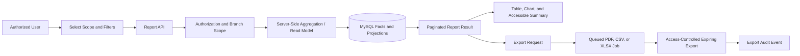

### Report characteristics

- Every report displays its branch scope, filters, timezone, currency, generation time, data cutoff, freshness state, and access classification.
- Interactive reports use server-side pagination, filtering, sorting, and aggregation; the browser receives only the requested slice.
- Large exports are generated asynchronously through DomPDF, Laravel Excel, or equivalent approved export services, then delivered through an authorization check at download time.
- Report definitions use controlled columns and calculation rules so table, chart, PDF, CSV, and XLSX output remain consistent.
- Inventory and sales reports reconcile to source transactions and movements. Historical snapshots are labeled as snapshots rather than presented as live values.

## 15. Audit Trail Architecture

The audit trail records who performed an important action, what changed, when it happened, and how it relates to the operational workflow. It is complementary to, not a replacement for, inventory movements and other domain histories.

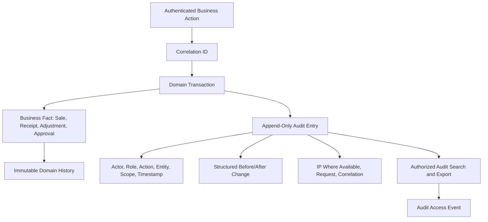

### Audit content and controls

Audit entries capture the actor, role, action, entity type and ID, branch or business scope, correlation ID, timestamp, request context, and structured before/after values when applicable. Authentication, authorization denials, approvals, exports, synchronization events, administrative changes, and every inventory-affecting action are audited.

Audit records are append-only and access is limited to authorized Owners and Managers. Audit searches and exports are audited as well. Sensitive fields such as passwords, tokens, session identifiers, and unnecessary personal data are redacted before storage. Audit payloads are schema-versioned so changes remain interpretable as the system evolves.

## 16. Operational Data Flows

### Procurement and receiving

An authorized user creates a purchase order from supplier and product data. The order progresses through documented draft, submitted, approved, ordered, partially received, received, cancelled, and closed states. Receiving validates the order, product, remaining quantity, unit, supplier delivery context, and traceability requirements. Posting a receipt atomically creates receipt facts, stock movements, balance changes, and audit records.

### Inventory adjustment and reversal

An adjustment requires a controlled reason, signed quantity, before and after values, accountable user, and approval when thresholds require it. A posted adjustment cannot be edited. Corrections create a compensating adjustment or reversal that references the original event.

### Restocking and notifications

Scheduled and event-triggered evaluation combines available stock, ROP, demand, lead time, safety stock, and reliable incoming supply. It produces ranked, deduplicated restocking alerts. Alerts inform authorized users; they do not autonomously create purchase orders.

## 17. Security, Reliability, and Observability

- All production traffic uses HTTPS, secure cookies, CSRF protection where applicable, rate limiting, secure headers, content security policy, and clickjacking protection.
- Secrets remain in managed environment configuration and are never committed, emitted by APIs, retained in browser storage, or written to logs.
- Structured logs include safe actor context, operation, entity references, correlation ID, release version, and error classification. Logs never include credentials or session material.
- Queued jobs are idempotent, bounded, observable, and safe to retry. Queue failures, sync failure growth, report failures, reconciliation exceptions, and backup failures produce actionable alerts.
- Backups, restore testing, recovery objectives, schema migration status, query latency, lock waits, and storage growth are operationally monitored.
- A data correction process uses authorized compensating records and audit evidence rather than direct production database edits.

## 18. Architectural Decision Boundaries

The following changes require an approved architectural decision before implementation:

- Introducing a microservice, event broker, external system of record, or new persistence technology.
- Changing the source of truth for inventory, pricing, authorization, reporting, or forecasting inputs.
- Altering formula definitions, demand policy, units-of-measure conventions, branch-scoping model, or retained historical facts.
- Adding automated purchasing, automated approval, unreviewed conflict resolution, or destructive data retention behavior.
- Storing additional sensitive information offline, changing session strategy, or broadening export capabilities.

This document is maintained with the system. Any material change to architecture, data ownership, workflow state, security controls, or operational recovery must update this document and the applicable rules in `CLAUDE.md` in the same change.
